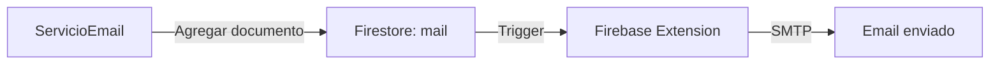

## Descripción General

`ServicioEmail` gestiona el envío de todos los emails del sistema, incluyendo confirmaciones de reserva, cancelaciones, y notificaciones al dueño del restaurante. Utiliza la extensión **Firebase Trigger Email** que procesa automáticamente los documentos de la colección `mail` en Firestore.

**Ubicación**: `lib/adaptadores/servicio_email.dart`

## Características Principales

- Emails de confirmación de reserva
- Notificaciones de cancelación (por cliente o restaurante)
- Notificaciones al dueño sobre nuevas reservas
- Templates HTML responsivos y profesionales
- Integración automática con Firebase Trigger Email Extension
- Mensajes en español con formato amigable

---

## Arquitectura

### ¿Cómo Funciona?

1. El servicio crea un documento en la colección `mail` de Firestore
2. La extensión Firebase Trigger Email detecta el nuevo documento
3. La extensión envía el email via SMTP
4. El documento se actualiza con el estado de envío



### Estructura del Documento en Firestore

```dart
{
  'to': ['destinatario@ejemplo.com'],
  'message': {
    'subject': 'Asunto del email',
    'html': '<html>...</html>',
  },
  'createdAt': Timestamp,
}
```

---

## Emails al Cliente

### enviarReservaConfirmada

```dart
Future<void> enviarReservaConfirmada({
  required String emailCliente,
  required String nombreCliente,
  required String nombreNegocio,
  required DateTime fechaHora,
  required String nombreMesa,
  required int numeroPersonas,
  String? telefono,
  String? reservaId,
})
```

Envía email de confirmación cuando una reserva es confirmada.

**Contenido del Email**:
- Mensaje de bienvenida y confirmación
- Detalles completos de la reserva (fecha, hora, mesa, personas)
- Estado: "Confirmada" (fondo verde)
- Tips importantes (llegar 10 min antes, política de cancelación)
- Información de contacto del restaurante

**Ejemplo**:
```dart
await servicioEmail.enviarReservaConfirmada(
  emailCliente: 'cliente@ejemplo.com',
  nombreCliente: 'Juan Pérez',
  nombreNegocio: 'Restaurante La Esquina',
  fechaHora: DateTime(2024, 3, 15, 20, 30),
  nombreMesa: 'Mesa 5',
  numeroPersonas: 4,
  reservaId: 'abc123',
);

print('📧 Email de confirmación enviado');
```

**Vista Previa del Email**:
```
✅ Reserva Confirmada

¡Tu reserva ha sido confirmada!

Hola Juan Pérez, tu reserva está confirmada. Te esperamos en:

👤 Nombre: Juan Pérez
🏪 Restaurante: Restaurante La Esquina
📍 Mesa: Mesa 5
📅 Fecha: viernes 15 de marzo de 2024
🕐 Horario: 20:30 hs
👥 Personas: 4

✅ Estado: Confirmada
```

### enviarReservaCanceladaPorCliente

```dart
Future<void> enviarReservaCanceladaPorCliente({
  required String emailCliente,
  required String nombreCliente,
  required String nombreNegocio,
  required DateTime fechaHora,
  required String nombreMesa,
  required int numeroPersonas,
})
```

Envía email cuando el cliente cancela su propia reserva.

**Contenido del Email**:
- Confirmación de cancelación
- Detalles de la reserva cancelada
- Estado: "Cancelada" (fondo rojo)
- Mensaje invitando a hacer una nueva reserva

**Ejemplo**:
```dart
await servicioEmail.enviarReservaCanceladaPorCliente(
  emailCliente: 'cliente@ejemplo.com',
  nombreCliente: 'Juan Pérez',
  nombreNegocio: 'Restaurante La Esquina',
  fechaHora: DateTime(2024, 3, 15, 20, 30),
  nombreMesa: 'Mesa 5',
  numeroPersonas: 4,
);
```

### enviarReservaCanceladaPorRestaurante

```dart
Future<void> enviarReservaCanceladaPorRestaurante({
  required String emailCliente,
  required String nombreCliente,
  required String nombreNegocio,
  required DateTime fechaHora,
  required String nombreMesa,
  required int numeroPersonas,
  String? motivo,
})
```

Envía email cuando el restaurante cancela la reserva del cliente.

**Contenido del Email**:
- Alerta de que el restaurante canceló la reserva (fondo amarillo)
- Detalles de la reserva
- Motivo de la cancelación (si se proporciona)
- Disculpas e invitación a reservar otra fecha

**Ejemplo**:
```dart
await servicioEmail.enviarReservaCanceladaPorRestaurante(
  emailCliente: 'cliente@ejemplo.com',
  nombreCliente: 'Juan Pérez',
  nombreNegocio: 'Restaurante La Esquina',
  fechaHora: DateTime(2024, 3, 15, 20, 30),
  nombreMesa: 'Mesa 5',
  numeroPersonas: 4,
  motivo: 'Cierre temporal por evento privado',
);
```

**Vista Previa del Email**:
```
⚠️ Reserva Cancelada

Tu reserva ha sido cancelada

⚠️ Atención: El restaurante ha cancelado tu reserva.

[Detalles de la reserva]

📝 Motivo:
Cierre temporal por evento privado

Lamentamos los inconvenientes. Puedes hacer una nueva reserva para otra fecha.
```

---

## Emails al Dueño del Restaurante

### enviarNuevaReservaAlDueno

```dart
Future<void> enviarNuevaReservaAlDueno({
  required String emailDueno,
  required String nombreCliente,
  required String emailCliente,
  required String? telefonoCliente,
  required DateTime fechaHora,
  required String nombreMesa,
  required int numeroPersonas,
  required String nombreNegocio,
})
```

Notifica al dueño cuando hay una nueva reserva confirmada.

**Contenido del Email**:
- Alerta de nueva reserva
- Detalles completos de la reserva
- Información de contacto del cliente (email y teléfono)

**Ejemplo**:
```dart
await servicioEmail.enviarNuevaReservaAlDueno(
  emailDueno: 'dueno@restaurante.com',
  nombreCliente: 'Juan Pérez',
  emailCliente: 'cliente@ejemplo.com',
  telefonoCliente: '+54 9 11 1234-5678',
  fechaHora: DateTime(2024, 3, 15, 20, 30),
  nombreMesa: 'Mesa 5',
  numeroPersonas: 4,
  nombreNegocio: 'Restaurante La Esquina',
);

print('📧 Dueño notificado de la nueva reserva');
```

**Vista Previa del Email**:
```
📋 Nueva Reserva

📋 Nueva Reserva Recibida

Tienes una nueva reserva confirmada en Restaurante La Esquina:

[Detalles de la reserva]

📧 Email cliente: cliente@ejemplo.com
📱 Teléfono: +54 9 11 1234-5678
```

### enviarCancelacionClienteAlDueno

```dart
Future<void> enviarCancelacionClienteAlDueno({
  required String emailDueno,
  required String nombreCliente,
  required DateTime fechaHora,
  required String nombreMesa,
  required int numeroPersonas,
  required String nombreNegocio,
})
```

Notifica al dueño cuando un cliente cancela su reserva.

**Contenido del Email**:
- Alerta de cancelación por cliente
- Detalles de la reserva cancelada
- Recordatorio de que la mesa quedó disponible

**Ejemplo**:
```dart
await servicioEmail.enviarCancelacionClienteAlDueno(
  emailDueno: 'dueno@restaurante.com',
  nombreCliente: 'Juan Pérez',
  fechaHora: DateTime(2024, 3, 15, 20, 30),
  nombreMesa: 'Mesa 5',
  numeroPersonas: 4,
  nombreNegocio: 'Restaurante La Esquina',
);
```

---

## Métodos de Conveniencia

Estos métodos trabajan directamente con la entidad `Reserva` para simplificar el envío de emails.

### notificarReservaConfirmada

```dart
Future<void> notificarReservaConfirmada(
  Reserva reserva, {
  required String nombreNegocio,
  required String nombreMesa,
  String? emailDueno,
})
```

Envía email de confirmación al cliente y notifica al dueño automáticamente.

**Ejemplo**:
```dart
final reserva = Reserva(
  id: 'abc123',
  nombreCliente: 'Juan Pérez',
  contactoCliente: 'cliente@ejemplo.com',
  fechaHora: DateTime(2024, 3, 15, 20, 30),
  numeroPersonas: 4,
  // ... otros campos
);

await servicioEmail.notificarReservaConfirmada(
  reserva,
  nombreNegocio: 'Restaurante La Esquina',
  nombreMesa: 'Mesa 5',
  emailDueno: 'dueno@restaurante.com',
);

// Se envían automáticamente:
// 1. Email de confirmación al cliente
// 2. Email de nueva reserva al dueño
```

### notificarReservaCanceladaPorCliente

```dart
Future<void> notificarReservaCanceladaPorCliente(
  Reserva reserva, {
  required String nombreNegocio,
  required String nombreMesa,
  String? emailDueno,
})
```

Notifica cancelación por cliente al cliente mismo y al dueño.

**Ejemplo**:
```dart
await servicioEmail.notificarReservaCanceladaPorCliente(
  reserva,
  nombreNegocio: 'Restaurante La Esquina',
  nombreMesa: 'Mesa 5',
  emailDueno: 'dueno@restaurante.com',
);

// Se envían automáticamente:
// 1. Email de cancelación al cliente
// 2. Email al dueño notificando la cancelación
```

### notificarReservaCanceladaPorRestaurante

```dart
Future<void> notificarReservaCanceladaPorRestaurante(
  Reserva reserva, {
  required String nombreNegocio,
  required String nombreMesa,
  String? motivo,
})
```

Notifica al cliente que el restaurante canceló su reserva.

**Ejemplo**:
```dart
await servicioEmail.notificarReservaCanceladaPorRestaurante(
  reserva,
  nombreNegocio: 'Restaurante La Esquina',
  nombreMesa: 'Mesa 5',
  motivo: 'Evento privado',
);
```

---

## Templates HTML

### Estructura del Template Base

Todos los emails usan el mismo template base con:

1. **Header verde** con el título del email
2. **Contenido** con los detalles
3. **Footer** con copyright y disclaimers

```dart
String _wrapTemplate({required String titulo, required String contenido})
```

**Características**:
- Diseño responsivo (600px max-width)
- Colores del sistema: Verde (#27AE60) para header
- Tipografía Arial/sans-serif
- Compatible con clientes de email populares

### Tabla de Detalles de Reserva

```dart
String _buildDetallesReserva({
  required String nombreCliente,
  required String nombreNegocio,
  required String nombreMesa,
  required String fecha,
  required String hora,
  required int personas,
})
```

Genera una tabla HTML con los detalles de la reserva:

| Campo | Valor |
|-------|-------|
| 👤 Nombre | Juan Pérez |
| 🏪 Restaurante | Restaurante La Esquina |
| 📍 Mesa | Mesa 5 |
| 📅 Fecha | viernes 15 de marzo de 2024 |
| 🕐 Horario | 20:30 hs |
| 👥 Personas | 4 |

---

## Formato de Fechas

### _formatearFecha

```dart
String _formatearFecha(DateTime fecha)
```

Formatea fechas al español completo:

**Ejemplos**:
- `lunes 15 de marzo de 2024`
- `sábado 25 de diciembre de 2024`

### _formatearHora

```dart
String _formatearHora(DateTime fecha)
```

Formatea horas en formato 24h:

**Ejemplos**:
- `20:30 hs`
- `14:00 hs`

---

## Integración con Firebase

### Requisitos Previos

1. **Instalar Firebase Trigger Email Extension**

```bash
firebase ext:install firebase/firestore-send-email
```

2. **Configurar la extensión**:
   - SMTP Host (ej: `smtp.gmail.com`)
   - SMTP Port (ej: `587`)
   - SMTP Username
   - SMTP Password
   - Email From (ej: `noreply@miapp.com`)

3. **Crear colección `mail`** en Firestore (se crea automáticamente al primer envío)

### Configuración de SMTP

<Tabs>
  <Tab title="Gmail">
    ```env
    SMTP_HOST=smtp.gmail.com
    SMTP_PORT=587
    SMTP_USERNAME=tu-email@gmail.com
    SMTP_PASSWORD=tu-app-password
    ```
    
    <Warning>
      Para Gmail, debes usar una **App Password**, no tu contraseña normal. Genera una en: [Contraseñas de aplicación de Google](https://myaccount.google.com/apppasswords)
    </Warning>
  </Tab>
  
  <Tab title="SendGrid">
    ```env
    SMTP_HOST=smtp.sendgrid.net
    SMTP_PORT=587
    SMTP_USERNAME=apikey
    SMTP_PASSWORD=tu-sendgrid-api-key
    ```
  </Tab>
  
  <Tab title="AWS SES">
    ```env
    SMTP_HOST=email-smtp.us-east-1.amazonaws.com
    SMTP_PORT=587
    SMTP_USERNAME=tu-smtp-username
    SMTP_PASSWORD=tu-smtp-password
    ```
  </Tab>
</Tabs>

### Estructura de la Colección `mail`

```
mail/
  └── {documentId}/
      ├── to: ['destinatario@ejemplo.com']
      ├── message:
      │   ├── subject: 'Asunto'
      │   └── html: '<html>...</html>'
      ├── createdAt: Timestamp
      ├── delivery: {
      │   ├── state: 'SUCCESS' | 'ERROR' | 'PENDING'
      │   ├── attempts: 1
      │   └── endTime: Timestamp
      │ }
```

### Monitoreo de Envíos

Puedes consultar el estado de los emails en Firestore:

```dart
final mailCollection = FirebaseFirestore.instance.collection('mail');
final doc = await mailCollection.doc(documentId).get();
final delivery = doc.data()?['delivery'];

if (delivery != null) {
  print('Estado: ${delivery["state"]}');
  print('Intentos: ${delivery["attempts"]}');
}
```

**Estados posibles**:
- `PENDING` - En cola para envío
- `PROCESSING` - Enviando
- `SUCCESS` - Enviado exitosamente
- `ERROR` - Error en el envío

---

## Logs y Debugging

El servicio imprime logs detallados en consola:

```dart
━━━━━━━━━━━━━━━━━━━━━━━━━━━━━━━━━━━━━━━━━━━━━━━━━
📧 Preparando email...
Para: cliente@ejemplo.com
Asunto: ✅ Reserva confirmada - Restaurante La Esquina
✅ Email agregado a cola de envío
📋 ID del documento: abc123xyz
━━━━━━━━━━━━━━━━━━━━━━━━━━━━━━━━━━━━━━━━━━━━━━━━━
```

### Errores Comunes

<AccordionGroup>
  <Accordion title="Email no se envía">
    **Verificar**:
    1. La extensión Firebase Trigger Email está instalada
    2. Las credenciales SMTP son correctas
    3. El documento se creó en la colección `mail`
    4. Revisar logs de Firebase Extensions en la consola
  </Accordion>
  
  <Accordion title="Error 'authentication-failed'">
    **Solución**:
    - Verifica el username y password SMTP
    - En Gmail, usa una App Password
    - Verifica que el host y puerto sean correctos
  </Accordion>
  
  <Accordion title="Email cae en spam">
    **Recomendaciones**:
    - Configura SPF, DKIM, y DMARC en tu dominio
    - Usa un servicio SMTP profesional (SendGrid, AWS SES)
    - Evita palabras spam en el asunto
    - Incluye un enlace de unsubscribe
  </Accordion>
</AccordionGroup>

---

## Mejores Prácticas

<CardGroup cols={2}>
  <Card title="Validar Emails" icon="envelope-circle-check">
    Siempre valida que el contacto del cliente sea un email antes de enviar:
    
    ```dart
    if (email != null && email.contains('@')) {
      await servicioEmail.enviarReservaConfirmada(...);
    }
    ```
  </Card>
  
  <Card title="Manejo de Errores" icon="triangle-exclamation">
    Envuelve las llamadas en try-catch para manejar fallos:
    
    ```dart
    try {
      await servicioEmail.enviar...();
    } catch (e) {
      print('Error enviando email: $e');
      // No bloquear el flujo principal
    }
    ```
  </Card>
  
  <Card title="No Bloquear UI" icon="clock">
    Los envíos de email son asíncronos. No esperes la confirmación para continuar:
    
    ```dart
    // Confirmar reserva primero
    await confirmarReserva();
    
    // Enviar email en paralelo (no await)
    servicioEmail.enviarReservaConfirmada(...);
    
    // Continuar con el flujo
    navegarAPantallaConfirmacion();
    ```
  </Card>
  
  <Card title="Logs Informativos" icon="file-lines">
    El servicio ya incluye logs. Úsalos para debugging:
    
    ```dart
    // Los logs aparecen automáticamente
    📧 Email de confirmación enviado a: cliente@ejemplo.com
    ```
  </Card>
</CardGroup>

---

## Ejemplo Completo: Flujo de Reserva

```dart
import 'package:cloud_firestore/cloud_firestore.dart';
import '../dominio/entidades/reserva.dart';
import '../adaptadores/servicio_email.dart';

class GestorReservas {
  final ServicioEmail _emailService = ServicioEmail();
  final FirebaseFirestore _firestore = FirebaseFirestore.instance;
  
  Future<void> crearReserva({
    required String clienteEmail,
    required String nombreCliente,
    required DateTime fechaHora,
    required String mesaId,
    required String nombreMesa,
    required int numeroPersonas,
    String? emailDueno,
  }) async {
    try {
      // 1. Crear reserva en Firestore
      final reservaRef = await _firestore.collection('reservas').add({
        'clienteEmail': clienteEmail,
        'nombreCliente': nombreCliente,
        'fechaHora': Timestamp.fromDate(fechaHora),
        'mesaId': mesaId,
        'numeroPersonas': numeroPersonas,
        'estado': 'confirmada',
        'creadaEn': FieldValue.serverTimestamp(),
      });
      
      print('✅ Reserva creada: ${reservaRef.id}');
      
      // 2. Enviar emails (no bloqueante)
      _emailService.enviarReservaConfirmada(
        emailCliente: clienteEmail,
        nombreCliente: nombreCliente,
        nombreNegocio: 'Mi Restaurante',
        fechaHora: fechaHora,
        nombreMesa: nombreMesa,
        numeroPersonas: numeroPersonas,
        reservaId: reservaRef.id,
      ).catchError((e) {
        print('⚠️ Error enviando email al cliente: $e');
      });
      
      // 3. Notificar al dueño
      if (emailDueno != null) {
        _emailService.enviarNuevaReservaAlDueno(
          emailDueno: emailDueno,
          nombreCliente: nombreCliente,
          emailCliente: clienteEmail,
          telefonoCliente: null,
          fechaHora: fechaHora,
          nombreMesa: nombreMesa,
          numeroPersonas: numeroPersonas,
          nombreNegocio: 'Mi Restaurante',
        ).catchError((e) {
          print('⚠️ Error notificando al dueño: $e');
        });
      }
      
      print('🎉 Reserva completada exitosamente');
      
    } catch (e) {
      print('❌ Error creando reserva: $e');
      rethrow;
    }
  }
  
  Future<void> cancelarReservaPorCliente(String reservaId) async {
    // Obtener datos de la reserva
    final doc = await _firestore.collection('reservas').doc(reservaId).get();
    final data = doc.data()!;
    
    // Actualizar estado
    await doc.reference.update({
      'estado': 'cancelada',
      'canceladaPor': 'cliente',
      'canceladaEn': FieldValue.serverTimestamp(),
    });
    
    // Enviar emails
    await _emailService.enviarReservaCanceladaPorCliente(
      emailCliente: data['clienteEmail'],
      nombreCliente: data['nombreCliente'],
      nombreNegocio: 'Mi Restaurante',
      fechaHora: (data['fechaHora'] as Timestamp).toDate(),
      nombreMesa: data['nombreMesa'],
      numeroPersonas: data['numeroPersonas'],
    );
  }
}
```

---

## Ver También

- [Servicio Autenticación](/api/services/autenticacion) - Para gestionar usuarios
- [Servicio Verificación Cliente](/api/services/verificacion-cliente) - Para verificación por SMS sin login
- [Firebase Trigger Email Extension](https://extensions.dev/extensions/firebase/firestore-send-email) - Documentación oficial de la extensión
