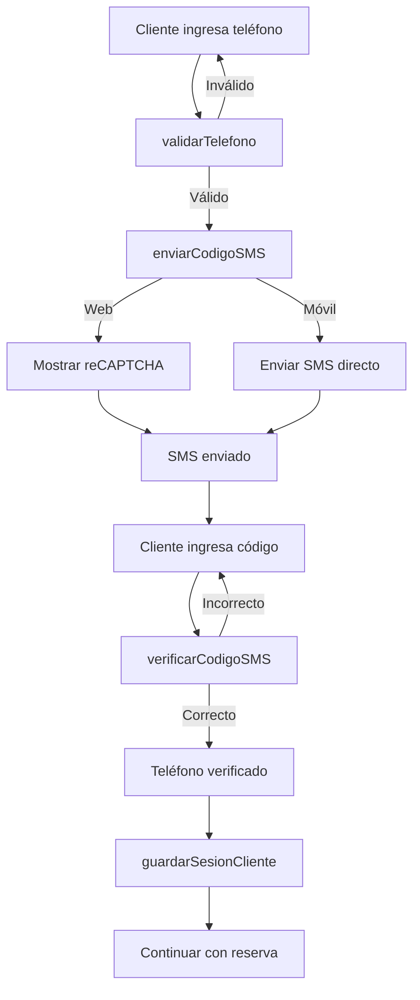

## Descripción General

`ServicioVerificacionCliente` maneja la verificación de identidad de clientes mediante SMS **sin crear sesiones permanentes**. Está diseñado para el flujo de reservas públicas donde los clientes verifican su teléfono, hacen una reserva, y luego la sesión se cierra automáticamente.

**Ubicación**: `lib/adaptadores/servicio_verificacion_cliente.dart`

## Características Principales

- Verificación por SMS sin login permanente
- Soporte para web (reCAPTCHA) y móvil
- Normalización de números argentinos a formato E.164
- Almacenamiento local de reservas en localStorage
- Sesiones temporales de cliente (30 días)
- Limpieza automática de reCAPTCHA

<Warning>
  Este servicio es diferente del [Servicio Autenticación](/api/services/autenticacion). Aquí las verificaciones son **temporales** y la sesión se cierra después de usarse.
</Warning>

---

## Diferencias con ServicioAutenticacion

| Característica | ServicioVerificacionCliente | ServicioAutenticacion |
|----------------|----------------------------|----------------------|
| **Propósito** | Verificación temporal para reservas | Login permanente de usuarios |
| **Sesión** | Se cierra después de verificar | Permanece activa |
| **Almacenamiento** | localStorage (cliente) | Firestore (servidor) |
| **Uso típico** | Clientes haciendo reservas | Dueños y administradores |
| **Email required** | No | Sí |

---

## Verificación SMS

### enviarCodigoSMS

```dart
Future<bool> enviarCodigoSMS({
  required String telefono,
  required Function(String) onCodigoEnviado,
  required Function(String) onError,
  required Function(String) onVerificacionAutomatica,
})
```

Envía un código de verificación por SMS. Maneja automáticamente las diferencias entre web y móvil.

**Comportamiento**:
- **Web**: Usa reCAPTCHA invisible y `signInWithPhoneNumber`
- **Móvil**: Usa `verifyPhoneNumber` tradicional
- **Android**: Puede verificarse automáticamente sin ingresar código

**Parámetros**:
- `telefono` - Número en formato local o E.164 (se normaliza automáticamente)
- `onCodigoEnviado` - Callback cuando el SMS se envía
- `onError` - Callback en caso de error
- `onVerificacionAutomatica` - Callback si se verifica automáticamente (solo Android)

**Retorna**: `true` si el proceso inició correctamente

**Ejemplo en Web**:
```dart
final servicio = ServicioVerificacionCliente();

await servicio.enviarCodigoSMS(
  telefono: '2622 123456',  // Mendoza
  onCodigoEnviado: (mensaje) {
    print(mensaje); // "Código enviado por SMS"
    setState(() {
      mostrarCampoCodigoSMS = true;
    });
  },
  onError: (error) {
    print('Error: $error');
    mostrarDialogoError(error);
  },
  onVerificacionAutomatica: (telefono) {
    print('Verificado automáticamente: $telefono');
    // En móvil Android puede ocurrir
    navegarASiguientePaso();
  },
);
```

**Ejemplo en Móvil (Android)**:
```dart
await servicio.enviarCodigoSMS(
  telefono: '+54 9 2622 123456',
  onCodigoEnviado: (_) {
    print('SMS enviado');
  },
  onError: (error) {
    print('Error: $error');
  },
  onVerificacionAutomatica: (telefono) {
    // Android puede verificar automáticamente el SMS
    print('¡Verificado automáticamente!');
    print('Teléfono: $telefono');
    guardarReserva();
  },
);
```

### verificarCodigoSMS

```dart
Future<String> verificarCodigoSMS({required String codigo})
```

Verifica el código SMS ingresado por el usuario.

**Parámetros**:
- `codigo` - Código de 6 dígitos recibido por SMS

**Retorna**: El teléfono verificado en formato E.164 (ej: `+5492622123456`)

**Excepciones**:
- `invalid-verification-code` - Código incorrecto
- `session-expired` - El código expiró (solicitar uno nuevo)

**Ejemplo**:
```dart
try {
  final telefonoVerificado = await servicio.verificarCodigoSMS(
    codigo: codigoIngresadoPorUsuario,
  );
  
  print('✅ Teléfono verificado: $telefonoVerificado');
  
  // Guardar sesión temporal
  servicio.guardarSesionCliente(
    telefonoVerificado,
    emailCliente,
  );
  
  // Continuar con la reserva
  navegarAFormularioReserva();
  
} on Exception catch (e) {
  if (e.toString().contains('incorrecto')) {
    mostrarError('El código es incorrecto. Verifica e intenta nuevamente.');
  } else if (e.toString().contains('expiró')) {
    mostrarError('El código expiró. Solicita uno nuevo.');
    mostrarBotonReenviar();
  } else {
    mostrarError('Error: $e');
  }
}
```

### limpiarRecaptcha

```dart
void limpiarRecaptcha()
```

Limpia el widget de reCAPTCHA de la página. Útil cuando el usuario cancela o hay un error.

**Ejemplo**:
```dart
// Al cerrar el diálogo de verificación
@override
void dispose() {
  servicio.limpiarRecaptcha();
  super.dispose();
}
```

---

## Normalización de Teléfono

### normalizarTelefono

```dart
String normalizarTelefono(String telefono)
```

Convierte cualquier formato de teléfono argentino a formato E.164 estándar.

**Formatos aceptados**:
```dart
// Formato local (Mendoza)
'2622 123456'        → '+5492622123456'
'0261 2123456'       → '+542612123456'
'261-212-3456'       → '+542612123456'

// Formato con 15
'15 2622 123456'     → '+5492622123456'
'011 15-1234-5678'   → '+5491112345678'

// Con código de país
'+54 9 2622 123456'  → '+5492622123456'
'+5491112345678'     → '+5491112345678'
```

**Reglas de normalización**:
1. Remueve espacios, guiones y paréntesis
2. Si no tiene `+`, agrega `+54` (Argentina)
3. Remueve `0` inicial si existe
4. Convierte formato local `15` a formato internacional `9`
5. Asegura que tenga el `9` después del código de área

**Ejemplo**:
```dart
final servicio = ServicioVerificacionCliente();

// Diferentes formatos de entrada
print(servicio.normalizarTelefono('2622 123456'));
// Output: +5492622123456

print(servicio.normalizarTelefono('011 15-1234-5678'));
// Output: +5491112345678

print(servicio.normalizarTelefono('+54 9 11 1234-5678'));
// Output: +5491112345678
```

### validarTelefono

```dart
Map<String, dynamic> validarTelefono(String telefono)
```

Valida un número de teléfono y retorna el resultado de la validación.

**Retorna**:
```dart
// Si es válido
{
  'valido': true,
  'formateado': '+5492622123456',
}

// Si es inválido
{
  'valido': false,
  'error': 'Número de teléfono inválido',
}
```

**Validaciones**:
- Longitud correcta para Argentina (13-14 dígitos)
- Debe empezar con `+54`
- Formato E.164 válido

**Ejemplo**:
```dart
final resultado = servicio.validarTelefono(telefonoIngresado);

if (resultado['valido']) {
  final telefonoFormateado = resultado['formateado'];
  await servicio.enviarCodigoSMS(telefono: telefonoFormateado, ...);
} else {
  mostrarError(resultado['error']);
}
```

---

## Almacenamiento Local de Reservas

<Info>
  Las reservas se guardan en `localStorage` del navegador para que el cliente pueda ver sus reservas sin necesidad de login.
</Info>

### guardarReserva

```dart
void guardarReserva(Map<String, dynamic> reserva)
```

Guarda una reserva en el localStorage del navegador.

**Estructura recomendada**:
```dart
{
  'reservaId': 'abc123',
  'clienteTelefono': '+5492622123456',
  'clienteNombre': 'Juan Pérez',
  'clienteEmail': 'juan@ejemplo.com',
  'nombreNegocio': 'Restaurante La Esquina',
  'nombreMesa': 'Mesa 5',
  'fechaHora': '2024-03-15T20:30:00.000Z',
  'numeroPersonas': 4,
  'estado': 'confirmada',
}
```

**Ejemplo**:
```dart
final reserva = {
  'reservaId': reservaDoc.id,
  'clienteTelefono': telefonoVerificado,
  'clienteNombre': nombreCliente,
  'clienteEmail': emailCliente,
  'nombreNegocio': negocio.nombre,
  'nombreMesa': mesa.nombre,
  'fechaHora': fechaHora.toIso8601String(),
  'numeroPersonas': numeroPersonas,
  'estado': 'confirmada',
};

servicio.guardarReserva(reserva);
print('✅ Reserva guardada en localStorage');
```

### obtenerTodasReservas

```dart
List<Map<String, dynamic>> obtenerTodasReservas()
```

Obtiene todas las reservas guardadas en localStorage.

**Retorna**: Lista de reservas o lista vacía si no hay ninguna

**Ejemplo**:
```dart
final reservas = servicio.obtenerTodasReservas();

print('Total de reservas: ${reservas.length}');

for (final reserva in reservas) {
  print('Reserva: ${reserva["nombreNegocio"]}');
  print('Fecha: ${reserva["fechaHora"]}');
  print('Estado: ${reserva["estado"]}');
}
```

### obtenerReservasPorTelefono

```dart
List<Map<String, dynamic>> obtenerReservasPorTelefono(String telefono)
```

Obtiene solo las reservas de un teléfono específico.

**Parámetros**:
- `telefono` - Teléfono en cualquier formato (se normaliza automáticamente)

**Ejemplo**:
```dart
// Después de verificar el teléfono
final telefonoVerificado = await servicio.verificarCodigoSMS(codigo: codigo);

// Obtener reservas del cliente
final misReservas = servicio.obtenerReservasPorTelefono(telefonoVerificado);

if (misReservas.isEmpty) {
  print('No tienes reservas activas');
} else {
  print('Tienes ${misReservas.length} reserva(s)');
  mostrarListaReservas(misReservas);
}
```

---

## Sesión Temporal del Cliente

<Info>
  Las sesiones temporales permiten que el cliente no tenga que verificar su teléfono cada vez que visita la página. Expiran después de 30 días.
</Info>

### guardarSesionCliente

```dart
void guardarSesionCliente(String telefono, String email)
```

Guarda una sesión temporal del cliente en localStorage con expiración de 30 días.

**Ejemplo**:
```dart
// Después de verificar el teléfono
final telefonoVerificado = await servicio.verificarCodigoSMS(codigo: codigo);

servicio.guardarSesionCliente(
  telefonoVerificado,
  emailCliente,
);

print('✅ Sesión guardada (válida por 30 días)');
```

### obtenerSesionCliente

```dart
Map<String, dynamic>? obtenerSesionCliente()
```

Obtiene la sesión del cliente si existe y no ha expirado.

**Retorna**:
```dart
// Si hay sesión válida
{
  'telefono': '+5492622123456',
  'email': 'cliente@ejemplo.com',
  'expiracion': '2024-04-15T10:30:00.000Z',
}

// Si no hay sesión o expiró
null
```

**Ejemplo de uso al cargar la app**:
```dart
@override
void initState() {
  super.initState();
  
  final servicio = ServicioVerificacionCliente();
  final sesion = servicio.obtenerSesionCliente();
  
  if (sesion != null) {
    // Hay sesión válida, cargar datos del cliente
    setState(() {
      telefonoCliente = sesion['telefono'];
      emailCliente = sesion['email'];
      sesionActiva = true;
    });
    
    // Mostrar reservas del cliente
    final reservas = servicio.obtenerReservasPorTelefono(telefonoCliente!);
    mostrarMisReservas(reservas);
  } else {
    // No hay sesión, mostrar pantalla de verificación
    navegarAVerificacion();
  }
}
```

### limpiarSesionCliente

```dart
void limpiarSesionCliente()
```

Elimina la sesión temporal del cliente.

**Ejemplo**:
```dart
// Al cerrar sesión o cancelar
servicio.limpiarSesionCliente();
print('Sesión eliminada');
navergarAPaginaInicial();
```

---

## Manejo de reCAPTCHA (Web)

### ¿Qué es reCAPTCHA?

En la web, Firebase requiere reCAPTCHA para verificar que el usuario es humano antes de enviar SMS. El servicio maneja esto automáticamente.

### Tipos de reCAPTCHA

1. **Invisible**: Se ejecuta en segundo plano (usado por defecto)
2. **Checkbox**: Muestra el típico "No soy un robot"
3. **Modal**: Aparece un popup de verificación

**Comportamiento actual**:
- Usa reCAPTCHA **invisible** (sin contenedor HTML)
- Firebase puede mostrar un modal automáticamente si detecta actividad sospechosa
- Se limpia automáticamente después de verificar

### Limpieza Automática

El servicio limpia el reCAPTCHA automáticamente en estos casos:

1. Después de verificar el código exitosamente
2. Si hay un error en la verificación
3. Si se llama manualmente a `limpiarRecaptcha()`

```dart
// Se limpia automáticamente
void _limpiarEstado() {
  _verificationId = null;
  _resendToken = null;
  _confirmationResult = null;
  _limpiarRecaptcha();  // Limpia el widget
}
```

### Troubleshooting reCAPTCHA

<AccordionGroup>
  <Accordion title="reCAPTCHA no desaparece">
    **Solución**:
    ```dart
    // Limpiar manualmente
    servicio.limpiarRecaptcha();
    ```
  </Accordion>
  
  <Accordion title="Error 'captcha-check-failed'">
    **Causas comunes**:
    - reCAPTCHA de Firebase no configurado correctamente
    - Dominio no autorizado en Firebase Console
    
    **Solución**:
    1. Ir a Firebase Console > Authentication > Sign-in method
    2. En Phone, agregar tu dominio a la lista de autorizados
    3. Recarga la página e intenta de nuevo
  </Accordion>
  
  <Accordion title="reCAPTCHA aparece repetidamente">
    **Solución**:
    ```dart
    // Asegúrate de limpiar el estado antes de reintentar
    servicio.limpiarRecaptcha();
    await Future.delayed(Duration(milliseconds: 500));
    await servicio.enviarCodigoSMS(...);
    ```
  </Accordion>
</AccordionGroup>

---

## Flujo Completo de Verificación

### Diagrama del Flujo



### Código Completo del Flujo

```dart
import 'package:flutter/material.dart';
import '../adaptadores/servicio_verificacion_cliente.dart';

class PantallaVerificacionCliente extends StatefulWidget {
  @override
  _PantallaVerificacionClienteState createState() =>
      _PantallaVerificacionClienteState();
}

class _PantallaVerificacionClienteState
    extends State<PantallaVerificacionCliente> {
  final ServicioVerificacionCliente _servicio = ServicioVerificacionCliente();
  final TextEditingController _telefonoController = TextEditingController();
  final TextEditingController _codigoController = TextEditingController();
  final TextEditingController _emailController = TextEditingController();

  bool _codigoEnviado = false;
  bool _cargando = false;
  String? _error;

  @override
  void initState() {
    super.initState();
    _verificarSesionExistente();
  }

  void _verificarSesionExistente() {
    final sesion = _servicio.obtenerSesionCliente();
    if (sesion != null) {
      // Ya hay sesión válida, ir directo a reservas
      print('Sesión activa encontrada');
      _navegarAReservas(
        sesion['telefono'],
        sesion['email'],
      );
    }
  }

  Future<void> _enviarCodigo() async {
    setState(() {
      _cargando = true;
      _error = null;
    });

    // 1. Validar teléfono
    final validacion = _servicio.validarTelefono(_telefonoController.text);
    if (!validacion['valido']) {
      setState(() {
        _error = validacion['error'];
        _cargando = false;
      });
      return;
    }

    // 2. Enviar código SMS
    final exito = await _servicio.enviarCodigoSMS(
      telefono: _telefonoController.text,
      onCodigoEnviado: (mensaje) {
        setState(() {
          _codigoEnviado = true;
          _cargando = false;
        });
        ScaffoldMessenger.of(context).showSnackBar(
          SnackBar(content: Text('✅ $mensaje')),
        );
      },
      onError: (error) {
        setState(() {
          _error = error;
          _cargando = false;
        });
      },
      onVerificacionAutomatica: (telefono) {
        // Solo en Android
        print('Verificado automáticamente: $telefono');
        _navegarAReservas(telefono, _emailController.text);
      },
    );

    if (!exito) {
      setState(() {
        _error = 'Error al enviar código';
        _cargando = false;
      });
    }
  }

  Future<void> _verificarCodigo() async {
    setState(() {
      _cargando = true;
      _error = null;
    });

    try {
      // 1. Verificar código
      final telefonoVerificado = await _servicio.verificarCodigoSMS(
        codigo: _codigoController.text,
      );

      print('✅ Teléfono verificado: $telefonoVerificado');

      // 2. Guardar sesión temporal
      _servicio.guardarSesionCliente(
        telefonoVerificado,
        _emailController.text,
      );

      // 3. Navegar a la pantalla de reservas
      _navegarAReservas(telefonoVerificado, _emailController.text);
    } catch (e) {
      setState(() {
        _error = e.toString();
        _cargando = false;
      });
    }
  }

  void _navegarAReservas(String telefono, String email) {
    Navigator.of(context).pushReplacement(
      MaterialPageRoute(
        builder: (_) => PantallaReservas(
          telefono: telefono,
          email: email,
        ),
      ),
    );
  }

  @override
  void dispose() {
    _servicio.limpiarRecaptcha();
    _telefonoController.dispose();
    _codigoController.dispose();
    _emailController.dispose();
    super.dispose();
  }

  @override
  Widget build(BuildContext context) {
    return Scaffold(
      appBar: AppBar(title: Text('Verificación de Cliente')),
      body: Padding(
        padding: EdgeInsets.all(16),
        child: Column(
          children: [
            if (_error != null)
              Container(
                padding: EdgeInsets.all(12),
                color: Colors.red.shade100,
                child: Text(_error!, style: TextStyle(color: Colors.red)),
              ),
            SizedBox(height: 16),
            if (!_codigoEnviado) ..[
              TextField(
                controller: _emailController,
                decoration: InputDecoration(
                  labelText: 'Email',
                  hintText: 'tu@email.com',
                ),
                keyboardType: TextInputType.emailAddress,
              ),
              SizedBox(height: 16),
              TextField(
                controller: _telefonoController,
                decoration: InputDecoration(
                  labelText: 'Teléfono',
                  hintText: '2622 123456',
                  helperText: 'Sin 0 ni 15',
                ),
                keyboardType: TextInputType.phone,
              ),
              SizedBox(height: 24),
              ElevatedButton(
                onPressed: _cargando ? null : _enviarCodigo,
                child: _cargando
                    ? CircularProgressIndicator()
                    : Text('Enviar código SMS'),
              ),
            ] else ..[
              Text('Código enviado a ${_telefonoController.text}'),
              SizedBox(height: 16),
              TextField(
                controller: _codigoController,
                decoration: InputDecoration(
                  labelText: 'Código SMS',
                  hintText: '123456',
                ),
                keyboardType: TextInputType.number,
                maxLength: 6,
              ),
              SizedBox(height: 24),
              ElevatedButton(
                onPressed: _cargando ? null : _verificarCodigo,
                child: _cargando
                    ? CircularProgressIndicator()
                    : Text('Verificar código'),
              ),
              TextButton(
                onPressed: () {
                  setState(() {
                    _codigoEnviado = false;
                    _codigoController.clear();
                  });
                  _servicio.limpiarRecaptcha();
                },
                child: Text('Cambiar teléfono'),
              ),
            ],
          ],
        ),
      ),
    );
  }
}
```

---

## Errores Comunes

### Códigos de Error de Firebase

| Código | Descripción | Solución |
|--------|-------------|----------|
| `invalid-phone-number` | Número no válido | Usar formato correcto: +54 9 2622 123456 |
| `too-many-requests` | Demasiados intentos | Esperar unos minutos antes de reintentar |
| `quota-exceeded` | Límite de SMS excedido | Verificar cuota en Firebase Console |
| `captcha-check-failed` | reCAPTCHA falló | Agregar dominio a lista autorizada en Firebase |
| `invalid-verification-code` | Código incorrecto | Verificar que el código sea correcto |
| `session-expired` | Verificación expiró | Solicitar un nuevo código |

---

## Configuración de Firebase

### Habilitar Phone Authentication

1. **Firebase Console** > Authentication > Sign-in method
2. Habilitar **Phone**
3. Agregar dominios autorizados (para web)

### Configurar Cuota de SMS

<Warning>
  Firebase cobra por los SMS enviados. Los primeros mensajes son gratuitos, pero debes configurar facturación para uso en producción.
</Warning>

**Cuota gratuita**: ~10 SMS por día

**Costos** (pueden variar):
- Argentina: ~$0.04 USD por SMS
- Verificaciones fallidas no se cobran

### Dominios Autorizados (Web)

Para que reCAPTCHA funcione en web:

1. Firebase Console > Authentication > Settings
2. En "Authorized domains", agregar:
   - `localhost` (para desarrollo)
   - `tu-dominio.com` (para producción)
   - Cualquier dominio donde esté desplegada la app

---

## Mejores Prácticas

<CardGroup cols={2}>
  <Card title="Validar Antes de Enviar" icon="check-circle">
    ```dart
    final validacion = servicio.validarTelefono(telefono);
    if (!validacion['valido']) {
      mostrarError(validacion['error']);
      return;
    }
    await servicio.enviarCodigoSMS(...);
    ```
  </Card>
  
  <Card title="Limpiar reCAPTCHA" icon="broom">
    ```dart
    @override
    void dispose() {
      servicio.limpiarRecaptcha();
      super.dispose();
    }
    ```
  </Card>
  
  <Card title="Manejar Sesiones" icon="clock">
    ```dart
    // Al iniciar la app
    final sesion = servicio.obtenerSesionCliente();
    if (sesion != null) {
      // Ya está verificado, saltar verificación
      irDirectoAReservas();
    }
    ```
  </Card>
  
  <Card title="No Persistir Sesión en Firebase" icon="shield">
    ```dart
    // Después de verificar, NO mantener la sesión de Firebase
    final telefono = await servicio.verificarCodigoSMS(codigo);
    
    // Guardar solo en localStorage
    servicio.guardarSesionCliente(telefono, email);
    
    // Firebase Auth limpiará la sesión automáticamente
    ```
  </Card>
</CardGroup>

---

## Ver También

- [Servicio Autenticación](/api/services/autenticacion) - Para login permanente de usuarios
- [Servicio Email](/api/services/email) - Para enviar confirmaciones por email
- [Firebase Phone Authentication](https://firebase.google.com/docs/auth/web/phone-auth) - Documentación oficial
