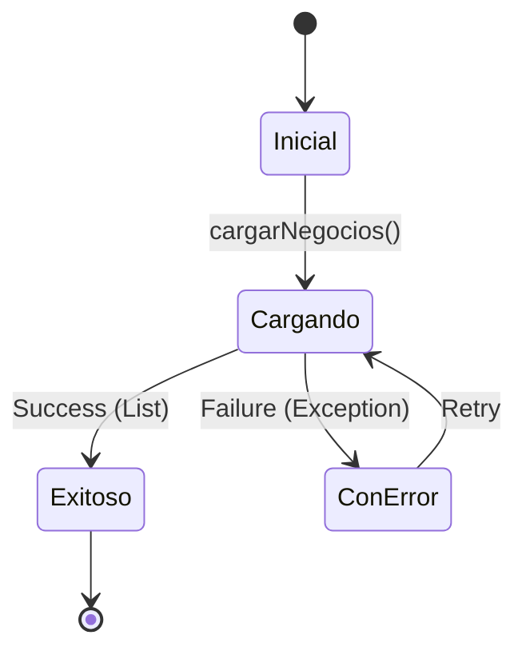

## Overview

`PantallaInicioCubit` manages the state for the restaurant selection screen (home screen), handling the loading and display of all available restaurants in the system.

**Source:** `lib/presentacion/pantalla_inicio/pantalla_inicio_cubit.dart`

## Purpose

This Cubit provides state management for:
- Loading all registered restaurants from Firestore
- Displaying restaurant list to customers
- Handling loading and error states
- Managing business owner authentication flows

## State Classes

**Source:** `lib/presentacion/pantalla_inicio/pantalla_inicio_estados_de_cubit.dart`

### PantallaInicioInicial

Initial state when the screen first loads.

```dart
class PantallaInicioInicial extends PantallaInicioState {}
```

**When used:** Screen initialization, before any data loading begins.

### PantallaInicioCargando

Loading state while fetching restaurants from Firestore.

```dart
class PantallaInicioCargando extends PantallaInicioState {}
```

**When emitted:** During `cargarNegocios()` execution.

### PantallaInicioExitoso

Success state with loaded restaurant list.

```dart
class PantallaInicioExitoso extends PantallaInicioState {
  final List<Negocio> negocios;
  
  PantallaInicioExitoso(this.negocios);
}
```

**Properties:**
- `negocios`: List of all available restaurants

**When emitted:** After successfully loading restaurants from the repository.

### PantallaInicioConError

Error state when loading fails.

```dart
class PantallaInicioConError extends PantallaInicioState {
  final String mensaje;
  
  PantallaInicioConError(this.mensaje);
}
```

**Properties:**
- `mensaje`: Error description in Spanish

**When emitted:** If repository call fails or throws exception.

## Methods

### cargarNegocios()

Loads all restaurants from Firestore.

```dart
Future<void> cargarNegocios() async
```

**Behavior:**
1. Emits `PantallaInicioCargando`
2. Calls `NegocioRepositorio.obtenerTodosLosNegocios()`
3. On success: Emits `PantallaInicioExitoso` with restaurant list
4. On error: Emits `PantallaInicioConError` with error message

**Source implementation:**

```dart
Future<void> cargarNegocios() async {
  emit(PantallaInicioCargando());
  
  try {
    final negocios = await _negocioRepositorio.obtenerTodosLosNegocios();
    emit(PantallaInicioExitoso(negocios));
  } catch (e) {
    emit(PantallaInicioConError('Error al cargar restaurantes: ${e.toString()}'));
  }
}
```

## Dependencies

### Constructor

```dart
class PantallaInicioCubit extends Cubit<PantallaInicioState> {
  final NegocioRepositorio _negocioRepositorio;
  
  PantallaInicioCubit(this._negocioRepositorio) 
    : super(PantallaInicioInicial());
}
```

**Required dependency:**
- `NegocioRepositorio`: For fetching restaurant data

### Dependency Injection

Registered in GetIt service locator:

```dart
// lib/service_locator.dart
getIt.registerFactory<PantallaInicioCubit>(
  () => PantallaInicioCubit(getIt<NegocioRepositorio>())
);
```

## Usage in UI

### Screen Integration

**Source:** `lib/presentacion/pantalla_inicio/pantalla_inicio_screen.dart`

```dart
class PantallaInicioScreen extends StatelessWidget {
  @override
  Widget build(BuildContext context) {
    return BlocProvider(
      create: (context) => getIt<PantallaInicioCubit>()..cargarNegocios(),
      child: const _PantallaInicioView(),
    );
  }
}
```

### State Handling

```dart
class _PantallaInicioView extends StatelessWidget {
  @override
  Widget build(BuildContext context) {
    return BlocBuilder<PantallaInicioCubit, PantallaInicioState>(
      builder: (context, state) {
        if (state is PantallaInicioCargando) {
          return const Center(child: CircularProgressIndicator());
        }
        
        if (state is PantallaInicioConError) {
          return Center(
            child: Column(
              mainAxisAlignment: MainAxisAlignment.center,
              children: [
                Icon(Icons.error, size: 64, color: Colors.red),
                SizedBox(height: 16),
                Text(state.mensaje),
              ],
            ),
          );
        }
        
        if (state is PantallaInicioExitoso) {
          final negocios = state.negocios;
          
          if (negocios.isEmpty) {
            return const Center(
              child: Text('No hay restaurantes disponibles'),
            );
          }
          
          return ListView.builder(
            itemCount: negocios.length,
            itemBuilder: (context, index) {
              final negocio = negocios[index];
              return RestauranteCard(negocio: negocio);
            },
          );
        }
        
        return const SizedBox.shrink();
      },
    );
  }
}
```

## State Flow Diagram



## Error Handling

### Common Errors

| Error | Cause | User Message |
|-------|-------|--------------|
| Network error | No internet connection | "Error al cargar restaurantes: Network error" |
| Firestore error | Database unavailable | "Error al cargar restaurantes: Firestore error" |
| Empty list | No restaurants in database | Shows "No hay restaurantes disponibles" |

### Retry Strategy

Users can retry by:
1. Pulling down to refresh the list
2. Tapping a "Reintentar" button (if implemented)

## Performance Considerations

### Caching

Currently, this Cubit does not cache restaurant data. Each screen load fetches fresh data from Firestore.

**Future improvement opportunity:**
```dart
// Could implement caching
List<Negocio>? _cachedNegocios;
DateTime? _lastFetchTime;

Future<void> cargarNegocios({bool forceRefresh = false}) async {
  if (!forceRefresh && _cachedNegocios != null) {
    if (DateTime.now().difference(_lastFetchTime!) < Duration(minutes: 5)) {
      emit(PantallaInicioExitoso(_cachedNegocios!));
      return;
    }
  }
  // ... fetch from repository
}
```

### Firestore Reads

Each call to `cargarNegocios()` reads all restaurant documents from Firestore. For large datasets, consider:
- Pagination
- Incremental loading
- Firestore query limits

## Testing

### Unit Test Example

```dart
void main() {
  late PantallaInicioCubit cubit;
  late MockNegocioRepositorio mockRepo;
  
  setUp(() {
    mockRepo = MockNegocioRepositorio();
    cubit = PantallaInicioCubit(mockRepo);
  });
  
  tearDown(() {
    cubit.close();
  });
  
  blocTest<PantallaInicioCubit, PantallaInicioState>(
    'emits [Cargando, Exitoso] when loading succeeds',
    build: () {
      when(() => mockRepo.obtenerTodosLosNegocios())
        .thenAnswer((_) async => [mockNegocio1, mockNegocio2]);
      return cubit;
    },
    act: (cubit) => cubit.cargarNegocios(),
    expect: () => [
      isA<PantallaInicioCargando>(),
      isA<PantallaInicioExitoso>()
        .having((s) => s.negocios.length, 'negocios count', 2),
    ],
  );
  
  blocTest<PantallaInicioCubit, PantallaInicioState>(
    'emits [Cargando, ConError] when loading fails',
    build: () {
      when(() => mockRepo.obtenerTodosLosNegocios())
        .thenThrow(Exception('Network error'));
      return cubit;
    },
    act: (cubit) => cubit.cargarNegocios(),
    expect: () => [
      isA<PantallaInicioCargando>(),
      isA<PantallaInicioConError>()
        .having((s) => s.mensaje, 'mensaje', contains('Network error')),
    ],
  );
}
```

## See Also

<CardGroup cols={2}>
  <Card title="Restaurant Selection" href="/customers/restaurant-selection">
    User guide for the restaurant selection screen
  </Card>
  <Card title="Negocio Entity" href="/api/entities/negocio">
    Restaurant data structure
  </Card>
  <Card title="NegocioRepositorio" href="/api/repositories/negocio-repositorio">
    Repository for loading restaurants
  </Card>
  <Card title="State Management Guide" href="/guides/state-management">
    BLoC/Cubit patterns in this project
  </Card>
</CardGroup>
