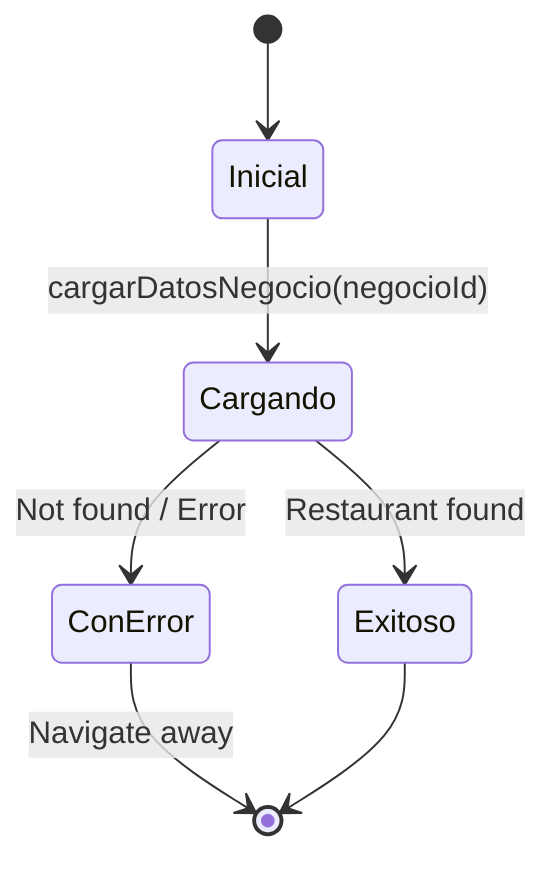

## Overview

`PantallaRestauranteCubit` manages the state for the restaurant details screen, handling the loading and display of a specific restaurant's information.

**Source:** `lib/presentacion/pantalla_restaurante/pantalla_restaurante_cubit.dart`

## Purpose

This Cubit provides state management for:
- Loading a specific restaurant's details from Firestore
- Displaying restaurant information, contact details, and specialties
- Managing loading and error states for the details screen
- Providing data for navigation to reservation features

## State Classes

**Source:** `lib/presentacion/pantalla_restaurante/pantalla_restaurante_estados_de_cubit.dart`

### PantallaRestauranteInicial

Initial state when the screen first loads.

```dart
class PantallaRestauranteInicial extends PantallaRestauranteState {}
```

**When used:** Screen initialization, before loading restaurant data.

### PantallaRestauranteCargando

Loading state while fetching restaurant details.

```dart
class PantallaRestauranteCargando extends PantallaRestauranteState {}
```

**When emitted:** During `cargarDatosNegocio()` execution.

### PantallaRestauranteExitoso

Success state with loaded restaurant details.

```dart
class PantallaRestauranteExitoso extends PantallaRestauranteState {
  final Negocio negocio;
  
  PantallaRestauranteExitoso(this.negocio);
}
```

**Properties:**
- `negocio`: Complete restaurant data including name, contact info, specialty, description

**When emitted:** After successfully loading the restaurant from Firestore.

### PantallaRestauranteConError

Error state when loading fails.

```dart
class PantallaRestauranteConError extends PantallaRestauranteState {
  final String mensaje;
  
  PantallaRestauranteConError(this.mensaje);
}
```

**Properties:**
- `mensaje`: Error description in Spanish

**When emitted:** If restaurant not found or repository call fails.

## Methods

### cargarDatosNegocio()

Loads a specific restaurant's details from Firestore.

```dart
Future<void> cargarDatosNegocio({String? negocioId}) async
```

**Parameters:**
- `negocioId` (optional): ID of the restaurant to load

**Behavior:**
1. Emits `PantallaRestauranteCargando`
2. Validates that `negocioId` is provided
3. Calls `NegocioRepositorio.obtenerNegocioPorId(negocioId)`
4. On success: Emits `PantallaRestauranteExitoso` with restaurant data
5. On error: Emits `PantallaRestauranteConError` with error message

**Source implementation:**

```dart
Future<void> cargarDatosNegocio({String? negocioId}) async {
  emit(PantallaRestauranteCargando());
  
  try {
    if (negocioId == null || negocioId.isEmpty) {
      emit(PantallaRestauranteConError('ID de negocio no proporcionado'));
      return;
    }
    
    final negocio = await _negocioRepositorio.obtenerNegocioPorId(negocioId);
    
    if (negocio == null) {
      emit(PantallaRestauranteConError('Restaurante no encontrado'));
      return;
    }
    
    emit(PantallaRestauranteExitoso(negocio));
  } catch (e) {
    emit(PantallaRestauranteConError(
      'Error al cargar datos del restaurante: ${e.toString()}'
    ));
  }
}
```

## Dependencies

### Constructor

```dart
class PantallaRestauranteCubit extends Cubit<PantallaRestauranteState> {
  final NegocioRepositorio _negocioRepositorio;
  
  PantallaRestauranteCubit(this._negocioRepositorio) 
    : super(PantallaRestauranteInicial());
}
```

**Required dependency:**
- `NegocioRepositorio`: For fetching restaurant data by ID

### Dependency Injection

Registered in GetIt service locator:

```dart
// lib/service_locator.dart
getIt.registerFactory<PantallaRestauranteCubit>(
  () => PantallaRestauranteCubit(getIt<NegocioRepositorio>())
);
```

## Usage in UI

### Screen Integration

**Source:** `lib/presentacion/pantalla_restaurante/pantalla_restaurante_screen.dart`

```dart
class PantallaRestauranteScreen extends StatelessWidget {
  final String? negocioId;
  
  const PantallaRestauranteScreen({super.key, this.negocioId});

  @override
  Widget build(BuildContext context) {
    return BlocProvider(
      create: (context) => PantallaRestauranteCubit()
        ..cargarDatosNegocio(negocioId: negocioId),
      child: _PantallaRestauranteView(negocioId: negocioId),
    );
  }
}
```

### State Handling

```dart
class _PantallaRestauranteView extends StatelessWidget {
  @override
  Widget build(BuildContext context) {
    return BlocBuilder<PantallaRestauranteCubit, PantallaRestauranteState>(
      builder: (context, state) {
        // Default values
        String nombreNegocio = 'Restaurante';
        String especialidad = 'Gastronomía';
        String? idNegocioActual = negocioId;

        if (state is PantallaRestauranteCargando) {
          return const Center(child: CircularProgressIndicator());
        }
        
        if (state is PantallaRestauranteExitoso) {
          nombreNegocio = state.negocio.nombre;
          especialidad = state.negocio.especialidad;
          idNegocioActual = state.negocio.id;
        }
        
        if (state is PantallaRestauranteConError) {
          return Center(
            child: Column(
              mainAxisAlignment: MainAxisAlignment.center,
              children: [
                Icon(Icons.error, size: 64, color: Colors.red),
                SizedBox(height: 16),
                Text(state.mensaje),
                ElevatedButton(
                  onPressed: () => context.go('/'),
                  child: Text('Volver al inicio'),
                ),
              ],
            ),
          );
        }
        
        return Scaffold(
          appBar: AppBar(
            title: Text(nombreNegocio),
          ),
          body: SingleChildScrollView(
            child: Column(
              children: [
                // Restaurant header
                // Action cards
                // Information section
              ],
            ),
          ),
        );
      },
    );
  }
}
```

## Navigation Flow

### Receiving the Restaurant ID

The screen receives `negocioId` via route navigation:

```dart
context.go('/restaurante', extra: negocioId);
```

### Passing ID to Child Screens

The loaded restaurant ID is passed to other features:

```dart
// Navigate to availability
context.go('/disponibilidad', extra: idNegocioActual);

// Navigate to history
context.go('/historia', extra: idNegocioActual);

// Navigate to reservations
context.go('/mis-reservas', extra: idNegocioActual);
```

## State Flow Diagram



## Error Handling

### Validation Errors

| Error | Cause | Message |
|-------|-------|---------|
| Missing ID | `negocioId` is null or empty | "ID de negocio no proporcionado" |
| Not found | Restaurant doesn't exist in Firestore | "Restaurante no encontrado" |
| Network error | Firestore unavailable | "Error al cargar datos del restaurante: ..." |

### Fallback Behavior

When in error or loading state, the UI displays default values:
- Name: "Restaurante"
- Specialty: "Gastronomía"

This ensures the UI remains functional while data loads.

## Data Usage

### Displayed Information

From the `Negocio` entity:

```dart
if (state is PantallaRestauranteExitoso) {
  final negocio = state.negocio;
  
  // Displayed fields:
  print(negocio.nombre);        // Restaurant name
  print(negocio.especialidad);  // Cuisine type
  print(negocio.descripcion);   // Full description
  print(negocio.direccion);     // Address
  print(negocio.telefono);      // Phone number
  print(negocio.email);         // Contact email
  print(negocio.icono);         // Icon identifier
}
```

## Testing

### Unit Test Example

```dart
void main() {
  late PantallaRestauranteCubit cubit;
  late MockNegocioRepositorio mockRepo;
  
  setUp(() {
    mockRepo = MockNegocioRepositorio();
    cubit = PantallaRestauranteCubit(mockRepo);
  });
  
  tearDown(() {
    cubit.close();
  });
  
  blocTest<PantallaRestauranteCubit, PantallaRestauranteState>(
    'emits [Cargando, Exitoso] when restaurant found',
    build: () {
      when(() => mockRepo.obtenerNegocioPorId('123'))
        .thenAnswer((_) async => mockNegocio);
      return cubit;
    },
    act: (cubit) => cubit.cargarDatosNegocio(negocioId: '123'),
    expect: () => [
      isA<PantallaRestauranteCargando>(),
      isA<PantallaRestauranteExitoso>()
        .having((s) => s.negocio.id, 'negocio.id', '123'),
    ],
  );
  
  blocTest<PantallaRestauranteCubit, PantallaRestauranteState>(
    'emits [Cargando, ConError] when negocioId is null',
    build: () => cubit,
    act: (cubit) => cubit.cargarDatosNegocio(negocioId: null),
    expect: () => [
      isA<PantallaRestauranteCargando>(),
      isA<PantallaRestauranteConError>()
        .having((s) => s.mensaje, 'mensaje', contains('no proporcionado')),
    ],
  );
  
  blocTest<PantallaRestauranteCubit, PantallaRestauranteState>(
    'emits [Cargando, ConError] when restaurant not found',
    build: () {
      when(() => mockRepo.obtenerNegocioPorId('999'))
        .thenAnswer((_) async => null);
      return cubit;
    },
    act: (cubit) => cubit.cargarDatosNegocio(negocioId: '999'),
    expect: () => [
      isA<PantallaRestauranteCargando>(),
      isA<PantallaRestauranteConError>()
        .having((s) => s.mensaje, 'mensaje', contains('no encontrado')),
    ],
  );
}
```

## See Also

<CardGroup cols={2}>
  <Card title="Restaurant Details" href="/customers/restaurant-details">
    User guide for the restaurant details screen
  </Card>
  <Card title="Negocio Entity" href="/api/entities/negocio">
    Complete restaurant data structure
  </Card>
  <Card title="NegocioRepositorio" href="/api/repositories/negocio-repositorio">
    Repository methods for restaurant data
  </Card>
  <Card title="PantallaInicioCubit" href="/api/state/pantalla-inicio-cubit">
    Related: Restaurant listing state
  </Card>
</CardGroup>
