## Overview

The **Adapters Layer** (also called Infrastructure Layer) implements the repository interfaces defined in the domain layer and provides connections to external services like Firebase, email, and authentication.

**Location:** `lib/adaptadores/`

```
lib/adaptadores/
├── adaptador_firestore_reserva.dart
├── adaptador_firestore_mesa.dart
├── adaptador_firestore_negocio.dart
├── adaptador_firestore_horario.dart
├── adaptador_firestore_historia.dart
├── servicio_email.dart
├── servicio_autenticacion_firebase.dart
└── servicio_verificacion_cliente.dart
```

## Firestore Adapters

### ReservaRepositorioFirestore

Implements reservation data access with Firestore.

```dart lib/adaptadores/adaptador_firestore_reserva.dart
class ReservaRepositorioFirestore implements ReservaRepositorio {
  final FirebaseFirestore _firestore = FirebaseFirestore.instance;
  
  CollectionReference<Map<String, dynamic>> get _reservasRef =>
      _firestore.collection('reservas');

  @override
  Future<Reserva> crearReserva(Reserva reserva) async {
    try {
      final docRef = await _reservasRef.add(_reservaToMap(reserva));
      print('✅ Reserva creada en Firestore: ${docRef.id}');
      return reserva.copyWith(id: docRef.id);
    } catch (e) {
      print('❌ Error creando reserva: $e');
      rethrow;
    }
  }

  @override
  Future<bool> mesaDisponible({
    required String mesaId,
    required DateTime fecha,
    required DateTime hora,
    required int duracionMinutos,
  }) async {
    try {
      // Get all reservations for this table on this date
      final reservas = await obtenerReservasPorMesaYHorario(
        mesaId: mesaId,
        fecha: fecha,
        hora: hora,
      );

      // Calculate the interval for the new reservation
      final horaInicioNueva = hora;
      final horaFinNueva = hora.add(Duration(minutes: duracionMinutos));

      // Check for time collisions with existing reservations
      for (final reserva in reservas) {
        final horaInicioExistente = reserva.fechaHora;
        final horaFinExistente = reserva.horaFin;

        // Collision if intervals overlap
        final hayColision = horaInicioNueva.isBefore(horaFinExistente) &&
            horaFinNueva.isAfter(horaInicioExistente);

        if (hayColision) {
          return false;
        }
      }

      return true;
    } catch (e) {
      print('❌ Error verificando disponibilidad: $e');
      return false;
    }
  }

  @override
  Future<List<Reserva>> obtenerReservasPorMesaYHorario({
    required String mesaId,
    required DateTime fecha,
    required DateTime hora,
  }) async {
    try {
      // Search reservations for the same day
      final inicioDia = DateTime(fecha.year, fecha.month, fecha.day);
      final finDia = inicioDia.add(const Duration(days: 1));

      final snapshot = await _reservasRef
          .where('mesaId', isEqualTo: mesaId)
          .where('fechaHora', isGreaterThanOrEqualTo: Timestamp.fromDate(inicioDia))
          .where('fechaHora', isLessThan: Timestamp.fromDate(finDia))
          .get();

      return snapshot.docs
          .map((doc) => _mapToReserva(doc.id, doc.data()))
          .where((r) => r.estado != EstadoReserva.cancelada)
          .toList();
    } catch (e) {
      print('❌ Error obteniendo reservas: $e');
      return [];
    }
  }

  // ============================================================
  // CONVERSION METHODS
  // ============================================================

  Map<String, dynamic> _reservaToMap(Reserva reserva) {
    return {
      'mesaId': reserva.mesaId,
      'fechaHora': Timestamp.fromDate(reserva.fechaHora),
      'numeroPersonas': reserva.numeroPersonas,
      'duracionMinutos': reserva.duracionMinutos,
      'estado': _estadoToString(reserva.estado),
      'contactoCliente': reserva.contactoCliente,
      'nombreCliente': reserva.nombreCliente,
      'telefonoCliente': reserva.telefonoCliente,
      'negocioId': reserva.negocioId,
      'createdAt': FieldValue.serverTimestamp(),
      'updatedAt': FieldValue.serverTimestamp(),
    };
  }

  Reserva _mapToReserva(String id, Map<String, dynamic> data) {
    return Reserva(
      id: id,
      mesaId: data['mesaId'] ?? '',
      fechaHora: (data['fechaHora'] as Timestamp).toDate(),
      numeroPersonas: data['numeroPersonas'] ?? 1,
      duracionMinutos: data['duracionMinutos'] ?? 60,
      estado: _stringToEstado(data['estado']),
      contactoCliente: data['contactoCliente'],
      nombreCliente: data['nombreCliente'],
      telefonoCliente: data['telefonoCliente'],
      negocioId: data['negocioId'],
    );
  }

  String _estadoToString(EstadoReserva estado) {
    switch (estado) {
      case EstadoReserva.pendiente:
        return 'pendiente';
      case EstadoReserva.confirmada:
        return 'confirmada';
      case EstadoReserva.cancelada:
        return 'cancelada';
    }
  }

  EstadoReserva _stringToEstado(String? estado) {
    switch (estado) {
      case 'confirmada':
        return EstadoReserva.confirmada;
      case 'cancelada':
        return EstadoReserva.cancelada;
      default:
        return EstadoReserva.pendiente;
    }
  }
}
```

<Note>
  **Key Pattern:** Adapters handle conversion between domain entities and external data formats. The domain never knows about Firestore `Timestamp` or `FieldValue`.
</Note>

### Time Collision Detection Algorithm

The availability check uses interval overlap detection:

```
Existing Reservation:  |-----60min-----|
New Reservation:              |-----60min-----|
                       │               │
                    Overlap! ❌

Condition: horaInicioNueva < horaFinExistente && horaFinNueva > horaInicioExistente
```



```mermaid
gantt
    title Table Availability Check
    dateFormat HH:mm
    section Existing
    Reserved (12:00-13:00) :done, 12:00, 60m
    section New Request
    Attempt (12:30-13:30) :crit, 12:30, 60m
```

### MesaRepositorioFirestore

Implements table management with smart availability search.

```dart lib/adaptadores/adaptador_firestore_mesa.dart
class MesaRepositorioFirestore implements MesaRepositorio {
  final FirebaseFirestore _firestore = FirebaseFirestore.instance;
  final ReservaRepositorio _reservaRepositorio;
  
  MesaRepositorioFirestore({required ReservaRepositorio reservaRepositorio})
      : _reservaRepositorio = reservaRepositorio;

  @override
  Future<Mesa?> buscarMesaDisponibleEnZona({
    required String zona,
    required DateTime fecha,
    required DateTime hora,
    required int numeroPersonas,
    required String negocioId,
  }) async {
    try {
      final mesas = await obtenerMesasPorNegocio(negocioId);
      
      // Filter tables in the zone that can accommodate the group
      final mesasZona = mesas
          .where((m) => m.zona == zona && m.puedeAcomodar(numeroPersonas))
          .toList();

      // Sort by capacity (prioritize best fit)
      mesasZona.sort((a, b) => a.capacidad.compareTo(b.capacidad));

      // Find first available table
      for (final mesa in mesasZona) {
        final disponible = await _reservaRepositorio.mesaDisponible(
          mesaId: mesa.id,
          fecha: fecha,
          hora: hora,
          duracionMinutos: 60,
        );

        if (disponible) {
          return mesa;
        }
      }

      return null;
    } catch (e) {
      print('❌ Error buscando mesa en zona: $e');
      return null;
    }
  }
}
```

<Info>
  The adapter **crosses layer boundaries** by depending on `ReservaRepositorio` to check availability. This is acceptable because both are in the adapters layer.
</Info>

## Services

### ServicioEmail

Handles all email notifications using Firebase Trigger Email Extension.

```dart lib/adaptadores/servicio_email.dart
class ServicioEmail {
  /// Sends confirmation email to customer
  Future<void> enviarReservaConfirmada({
    required String emailCliente,
    required String nombreCliente,
    required String nombreNegocio,
    required DateTime fechaHora,
    required String nombreMesa,
    required int numeroPersonas,
  }) async {
    final fecha = _formatearFecha(fechaHora);
    final hora = _formatearHora(fechaHora);

    final html = _wrapTemplate(
      titulo: '✅ Reserva Confirmada',
      contenido: '''
        <h2>Tu reserva ha sido confirmada</h2>
        <p>Hola $nombreCliente, tu reserva está confirmada.</p>
        
        ${_buildDetallesReserva(
          nombreCliente: nombreCliente,
          nombreNegocio: nombreNegocio,
          nombreMesa: nombreMesa,
          fecha: fecha,
          hora: hora,
          personas: numeroPersonas,
        )}
        
        <div style="background: #E8F5E9; padding: 15px;">
          <strong>✅ Estado:</strong> Confirmada
        </div>
      ''',
    );

    await _enviarEmail(
      to: emailCliente,
      subject: '✅ Reserva confirmada - $nombreNegocio',
      html: html,
    );
  }

  /// Sends cancellation email when customer cancels
  Future<void> enviarReservaCanceladaPorCliente({ /* ... */ }) async {
    // Similar structure
  }

  /// Sends cancellation email when restaurant cancels
  Future<void> enviarReservaCanceladaPorRestaurante({
    required String motivo,
    // ...
  }) async {
    // Includes cancellation reason
  }

  /// Notifies restaurant owner of new reservation
  Future<void> enviarNuevaReservaAlDueno({ /* ... */ }) async {
    // Email to restaurant owner
  }

  // ============================================================
  // FIREBASE TRIGGER EMAIL
  // ============================================================

  Future<void> _enviarEmail({
    required String to,
    required String subject,
    required String html,
  }) async {
    try {
      // Add document to Firestore - Firebase Extension processes it
      final docRef = await FirebaseFirestore.instance.collection('mail').add({
        'to': [to],  // Extension expects array
        'message': {
          'subject': subject,
          'html': html,
        },
        'createdAt': FieldValue.serverTimestamp(),
      });

      print('✅ Email agregado a cola de envío: ${docRef.id}');
    } catch (e) {
      print('❌ Error al agregar email a Firestore: $e');
      rethrow;
    }
  }
}
```

<Warning>
  Emails are sent asynchronously by the Firebase Trigger Email Extension. The app doesn't wait for actual delivery, only for the document to be added to the `mail` collection.
</Warning>

### ServicioAutenticacion

Handles Firebase Authentication for restaurant owners.

```dart lib/adaptadores/servicio_autenticacion_firebase.dart
class ServicioAutenticacion {
  final FirebaseAuth _auth = FirebaseAuth.instance;
  GoogleSignIn? _googleSignIn;

  Stream<User?> get authStateChanges => _auth.authStateChanges();
  User? get usuarioActual => _auth.currentUser;
  bool get estaAutenticado => _auth.currentUser != null;

  /// Register with email/password
  Future<UserCredential?> registrarConEmail({
    required String email,
    required String password,
  }) async {
    try {
      final userCredential = await _auth.createUserWithEmailAndPassword(
        email: email,
        password: password,
      );

      // Send verification email automatically
      if (userCredential.user != null) {
        await enviarEmailVerificacion();
      }

      return userCredential;
    } on FirebaseAuthException catch (e) {
      throw _manejarError(e);
    }
  }

  /// Sign in with email/password
  Future<UserCredential?> iniciarSesionConEmail({
    required String email,
    required String password,
  }) async {
    try {
      return await _auth.signInWithEmailAndPassword(
        email: email,
        password: password,
      );
    } on FirebaseAuthException catch (e) {
      throw _manejarError(e);
    }
  }

  /// Sign in with Google
  Future<UserCredential?> iniciarSesionConGoogle() async {
    if (kIsWeb) {
      // Web: Use popup
      final googleProvider = GoogleAuthProvider();
      googleProvider.setCustomParameters({'prompt': 'select_account'});
      return await _auth.signInWithPopup(googleProvider);
    } else {
      // Mobile: Use google_sign_in package
      final GoogleSignInAccount? googleUser = await googleSignIn.signIn();
      if (googleUser == null) return null;

      final GoogleSignInAuthentication googleAuth =
          await googleUser.authentication;

      final credential = GoogleAuthProvider.credential(
        accessToken: googleAuth.accessToken,
        idToken: googleAuth.idToken,
      );

      return await _auth.signInWithCredential(credential);
    }
  }

  /// Sign out
  Future<void> cerrarSesion() async {
    await _auth.signOut();
    if (!kIsWeb && _googleSignIn != null) {
      await _googleSignIn!.signOut();
    }
  }

  /// Send SMS verification code
  Future<bool> enviarCodigoSMS({
    required String numeroTelefono,
    required Function(String) onCodeSent,
    required Function(String) onError,
    required Function() onAutoVerified,
  }) async {
    try {
      final phoneNumber = _formatearNumeroTelefono(numeroTelefono);

      await _auth.verifyPhoneNumber(
        phoneNumber: phoneNumber,
        timeout: const Duration(seconds: 60),
        verificationCompleted: (PhoneAuthCredential credential) async {
          // Auto-verification (Android)
          try {
            final user = _auth.currentUser;
            if (user != null) {
              await user.linkWithCredential(credential);
              onAutoVerified();
            }
          } catch (e) {
            onError('Error en verificación automática: $e');
          }
        },
        verificationFailed: (FirebaseAuthException e) {
          String mensaje;
          switch (e.code) {
            case 'invalid-phone-number':
              mensaje = 'Número inválido. Usa formato: +54 9 11 1234-5678';
              break;
            case 'too-many-requests':
              mensaje = 'Demasiados intentos. Intenta más tarde';
              break;
            default:
              mensaje = 'Error: ${e.message}';
          }
          onError(mensaje);
        },
        codeSent: (String verificationId, int? resendToken) {
          _verificationId = verificationId;
          _resendToken = resendToken;
          onCodeSent('Código enviado por SMS');
        },
        codeAutoRetrievalTimeout: (String verificationId) {
          _verificationId = verificationId;
        },
      );

      return true;
    } catch (e) {
      onError('Error al enviar SMS: $e');
      return false;
    }
  }

  /// Verify SMS code
  Future<void> verificarCodigoSMS({required String codigo}) async {
    if (_verificationId == null) {
      throw Exception('Primero debes solicitar el código SMS');
    }

    try {
      final credential = PhoneAuthProvider.credential(
        verificationId: _verificationId!,
        smsCode: codigo,
      );

      final user = _auth.currentUser;
      if (user == null) {
        throw Exception('No hay usuario autenticado');
      }

      await user.updatePhoneNumber(credential);
      _verificationId = null;
      _resendToken = null;
    } on FirebaseAuthException catch (e) {
      switch (e.code) {
        case 'invalid-verification-code':
          throw Exception('Código incorrecto');
        case 'credential-already-in-use':
          throw Exception('Este número ya está vinculado a otra cuenta');
        default:
          throw Exception('Error: ${e.message}');
      }
    }
  }

  /// Format phone number to E.164 format
  /// Example: "11 1234-5678" → "+5491112345678"
  String _formatearNumeroTelefono(String numero) {
    String limpio = numero.replaceAll(RegExp(r'[\s\-\(\)]'), '');

    if (!limpio.startsWith('+')) {
      if (limpio.startsWith('0')) limpio = limpio.substring(1);
      if (limpio.startsWith('15')) limpio = '9${limpio.substring(2)}';
      if (!limpio.startsWith('9') && limpio.length == 10) limpio = '9$limpio';
      limpio = '+54$limpio';
    }

    return limpio;
  }
}
```

<Info>
  Phone number formatting is crucial for Firebase Auth. The service handles Argentine phone numbers, converting formats like "11 1234-5678" to E.164 format "+5491112345678".
</Info>

## Data Conversion Patterns

### Entity to Map (for Firestore)

```dart
Map<String, dynamic> _entityToMap(Entity entity) {
  return {
    'field1': entity.field1,
    'dateField': Timestamp.fromDate(entity.dateField),
    'enumField': _enumToString(entity.enumField),
    'createdAt': FieldValue.serverTimestamp(),
  };
}
```

### Map to Entity (from Firestore)

```dart
Entity _mapToEntity(String id, Map<String, dynamic> data) {
  return Entity(
    id: id,
    field1: data['field1'] ?? 'default',
    dateField: (data['dateField'] as Timestamp).toDate(),
    enumField: _stringToEnum(data['enumField']),
  );
}
```

### Enum Conversion

```dart
String _enumToString(MyEnum value) {
  switch (value) {
    case MyEnum.value1:
      return 'value1';
    case MyEnum.value2:
      return 'value2';
  }
}

MyEnum _stringToEnum(String? value) {
  switch (value) {
    case 'value1':
      return MyEnum.value1;
    case 'value2':
      return MyEnum.value2;
    default:
      return MyEnum.value1;  // Default
  }
}
```

## Firestore Collections

```
Firestore Database
├── reservas/
│   └── {reservaId}
│       ├── mesaId: string
│       ├── fechaHora: timestamp
│       ├── numeroPersonas: number
│       ├── duracionMinutos: number
│       ├── estado: string
│       ├── contactoCliente: string
│       ├── nombreCliente: string
│       ├── telefonoCliente: string
│       ├── negocioId: string
│       ├── createdAt: timestamp
│       └── updatedAt: timestamp
├── mesas/
│   └── {mesaId}
│       ├── nombre: string
│       ├── capacidad: number
│       ├── negocioId: string
│       └── zona: string
├── negocios/
│   └── {negocioId}
│       ├── nombre: string
│       ├── email: string
│       ├── minHorasParaCancelar: number
│       ├── maxDiasAnticipacionReserva: number
│       └── ...
└── mail/  (Firebase Trigger Email Extension)
    └── {emailId}
        ├── to: array
        ├── message: map
        └── delivery: map (added by extension)
```

## Error Handling

Adapters handle infrastructure errors gracefully:

```dart
try {
  // Firestore operation
  final result = await _firestore.collection('...').doc('...').get();
  return _mapToEntity(result);
} catch (e) {
  print('❌ Error en adaptador: $e');
  
  // Options:
  // 1. Return null/empty for queries
  return null;
  
  // 2. Rethrow for critical operations
  rethrow;
  
  // 3. Return default value
  return [];
}
```

## Testing Adapters

Adapters can be tested with:

1. **Firebase Emulator** (integration tests)
2. **Mock Firestore** (unit tests)

```dart
test('ReservaRepositorioFirestore creates reservation', () async {
  // Setup Firebase emulator
  final firestore = FirebaseFirestore.instance;
  firestore.useFirestoreEmulator('localhost', 8080);
  
  final repo = ReservaRepositorioFirestore();
  final reserva = Reserva(/* ... */);
  
  final created = await repo.crearReserva(reserva);
  
  expect(created.id, isNotEmpty);
  
  // Verify in Firestore
  final doc = await firestore.collection('reservas').doc(created.id).get();
  expect(doc.exists, isTrue);
});
```

## Summary

<CardGroup cols={2}>
  <Card title="Implement Interfaces" icon="plug">
    Adapters implement domain repository interfaces
  </Card>
  
  <Card title="Handle External APIs" icon="cloud">
    Connect to Firebase, email services, authentication
  </Card>
  
  <Card title="Convert Data" icon="arrows-rotate">
    Transform between domain entities and external formats
  </Card>
  
  <Card title="Graceful Errors" icon="shield">
    Handle infrastructure failures without crashing
  </Card>
</CardGroup>

## Next Steps

<CardGroup cols={2}>
  <Card title="Domain Layer" icon="cube" href="/architecture/domain-layer">
    See the interfaces these adapters implement
  </Card>
  
  <Card title="Presentation Layer" icon="window-maximize" href="/architecture/presentation-layer">
    Learn how the UI consumes these adapters through use cases
  </Card>
</CardGroup>