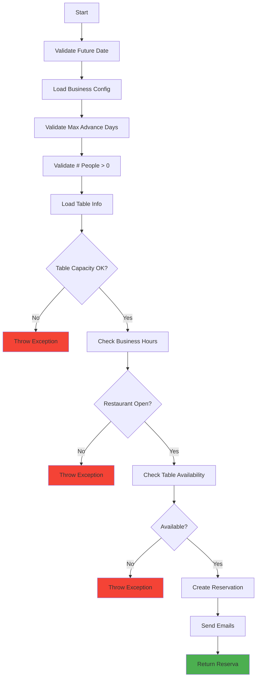

## Overview

The **Application Layer** contains use cases that implement business operations. Each use case represents a single user action or business flow, orchestrating domain entities and repository interfaces to achieve a specific goal.

**Location:** `lib/aplicacion/`

```
lib/aplicacion/
├── crear_reserva.dart
├── cancelar_reserva.dart
└── obtener_reserva.dart
```

## Key Principles

<CardGroup cols={2}>
  <Card title="Single Responsibility" icon="bullseye">
    Each use case does one thing well. `CrearReserva` only creates reservations.
  </Card>
  
  <Card title="Business Logic" icon="brain">
    Use cases contain orchestration logic, not framework code. Pure business rules.
  </Card>
  
  <Card title="Repository Pattern" icon="database">
    Use cases depend on repository **interfaces**, not concrete implementations.
  </Card>
  
  <Card title="Dependency Injection" icon="plug">
    Dependencies are injected via constructors, enabling testability and flexibility.
  </Card>
</CardGroup>

## Use Cases

### CrearReserva (Create Reservation)

Orchestrates the entire reservation creation flow with comprehensive validation.

```dart lib/aplicacion/crear_reserva.dart
class CrearReserva {
  final ReservaRepositorio reservaRepositorio;
  final MesaRepositorio? mesaRepositorio;
  final HorarioAperturaRepositorio? horarioAperturaRepositorio;
  final NegocioRepositorio? negocioRepositorio;
  final ServicioEmail? servicioEmail;

  CrearReserva(
    this.reservaRepositorio, {
    this.mesaRepositorio,
    this.horarioAperturaRepositorio,
    this.negocioRepositorio,
    this.servicioEmail,
  });

  Future<Reserva> ejecutar(
    String mesaId,
    DateTime fecha,
    DateTime hora,
    int numeroPersonas, {
    String? contactoCliente,
    String? nombreCliente,
    String? telefonoCliente,
    EstadoReserva estadoInicial = EstadoReserva.pendiente,
    required String negocioId,
  }) async {
    final now = DateTime.now();
    final fechaHora = DateTime(
      fecha.year, fecha.month, fecha.day,
      hora.hour, hora.minute
    );
    
    // === VALIDATION STEP 1: Date/time in the future ===
    if (fechaHora.isBefore(now)) {
      throw Exception('La fecha y hora deben ser futuras.');
    }
    
    // === LOAD BUSINESS CONFIGURATION ===
    int maxDiasAnticipacion = 14;  // Default
    int duracionMinutos = 60;
    String nombreNegocio = 'Restaurante';
    String? emailDueno;
    
    if (negocioRepositorio != null) {
      final negocio = await negocioRepositorio!.obtenerNegocioPorId(negocioId);
      if (negocio != null) {
        maxDiasAnticipacion = negocio.maxDiasAnticipacionReserva;
        duracionMinutos = negocio.duracionPromedioMinutos;
        nombreNegocio = negocio.nombre;
        emailDueno = negocio.email;
      }
    }
    
    // === VALIDATION STEP 2: Maximum advance booking ===
    final maximoFechaReserva = now.add(Duration(days: maxDiasAnticipacion));
    if (fechaHora.isAfter(maximoFechaReserva)) {
      throw Exception(
        'Solo se pueden hacer reservas hasta dentro de $maxDiasAnticipacion días.'
      );
    }
    
    // === VALIDATION STEP 3: Number of people ===
    if (numeroPersonas <= 0) {
      throw Exception('El número de personas debe ser mayor a cero.');
    }
    
    // === VALIDATION STEP 4: Table capacity ===
    String nombreMesa = 'Mesa';
    if (mesaRepositorio != null) {
      final mesa = await mesaRepositorio!.obtenerMesaPorId(mesaId);
      
      if (mesa == null) {
        throw Exception('La mesa seleccionada no existe.');
      }
      
      nombreMesa = mesa.nombre;
      
      if (!mesa.puedeAcomodar(numeroPersonas)) {
        if (mesa.capacidad < numeroPersonas) {
          throw Exception(
            'La mesa tiene capacidad para ${mesa.capacidad} persona(s), '
            'pero necesitas $numeroPersonas. Selecciona una mesa más grande.'
          );
        } else {
          final diferencia = mesa.capacidad - numeroPersonas;
          throw Exception(
            'La mesa tiene capacidad para ${mesa.capacidad} personas, '
            'pero solo necesitas $numeroPersonas. '
            'Diferencia de $diferencia lugares. '
            'Selecciona una mesa más adecuada (máx +3 diferencia).'
          );
        }
      }
    }
    
    // === VALIDATION STEP 5: Business hours ===
    if (horarioAperturaRepositorio != null) {
      final estaAbierto = await horarioAperturaRepositorio!.estaAbiertoEn(
        negocioId,
        fechaHora,
      );
      
      if (!estaAbierto) {
        final mensajeError = 
            await horarioAperturaRepositorio!.obtenerMensajeHorarioCerrado(
          negocioId,
          fechaHora,
        );
        throw Exception(mensajeError);
      }
    }
    
    // === VALIDATION STEP 6: Table availability ===
    final mesaDisponible = await reservaRepositorio.mesaDisponible(
      mesaId: mesaId,
      fecha: fecha,
      hora: fechaHora,
      duracionMinutos: duracionMinutos,
    );
    
    if (!mesaDisponible) {
      throw Exception(
        'La mesa ya está reservada en ese horario. '
        'Elige otra mesa u otro horario.'
      );
    }
    
    // === CREATE RESERVATION ===
    final reservaTemporal = Reserva(
      id: '',  // Firestore will generate ID
      mesaId: mesaId,
      fechaHora: fechaHora,
      numeroPersonas: numeroPersonas,
      duracionMinutos: duracionMinutos,
      estado: estadoInicial,
      contactoCliente: contactoCliente,
      nombreCliente: nombreCliente,
      telefonoCliente: telefonoCliente,
      negocioId: negocioId,
    );
    
    final reserva = await reservaRepositorio.crearReserva(reservaTemporal);

    // === SEND EMAIL NOTIFICATIONS ===
    if (servicioEmail != null) {
      try {
        await servicioEmail!.notificarReservaConfirmada(
          reserva,
          nombreNegocio: nombreNegocio,
          nombreMesa: nombreMesa,
          emailDueno: emailDueno,
        );
        print('📧 Emails de confirmación enviados');
      } catch (e) {
        // Don't fail reservation creation if email fails
        print('⚠️ Error enviando email: $e');
      }
    }

    return reserva;
  }
}
```

#### Validation Flow



<Note>
  The use case performs **6 validation steps** before creating the reservation, ensuring all business rules are satisfied.
</Note>

### CancelarReserva (Cancel Reservation)

Handles reservation cancellation with different rules for customers vs. administrators.

```dart lib/aplicacion/cancelar_reserva.dart
class CancelarReserva {
  final ReservaRepositorio reservaRepositorio;
  final NegocioRepositorio? negocioRepositorio;
  final MesaRepositorio? mesaRepositorio;
  final ServicioEmail? servicioEmail;

  CancelarReserva(
    this.reservaRepositorio, {
    this.negocioRepositorio,
    this.mesaRepositorio,
    this.servicioEmail,
  });

  /// Cancel reservation by customer (with time restrictions)
  Future<void> ejecutar(String reservaId, {required String negocioId}) async {
    final reserva = await reservaRepositorio.obtenerReservaPorId(reservaId);
    if (reserva == null) {
      throw Exception('Reserva no encontrada');
    }
    
    // Load business configuration
    int minHorasParaCancelar = 24;  // Default
    String nombreNegocio = 'Restaurante';
    String? emailDueno;
    
    if (negocioRepositorio != null) {
      final negocio = await negocioRepositorio!.obtenerNegocioPorId(negocioId);
      if (negocio != null) {
        minHorasParaCancelar = negocio.minHorasParaCancelar;
        nombreNegocio = negocio.nombre;
        emailDueno = negocio.email;
      }
    }
    
    // VALIDATION 1: Only confirmada/pendiente can be cancelled
    if (reserva.estado != EstadoReserva.confirmada && 
        reserva.estado != EstadoReserva.pendiente) {
      throw Exception('Solo se pueden cancelar reservas confirmadas o pendientes.');
    }
    
    // VALIDATION 2: Cannot cancel past reservations
    final ahora = DateTime.now();
    if (reserva.fechaHora.isBefore(ahora)) {
      throw Exception('No se puede cancelar una reserva cuya hora ya pasó.');
    }
    
    // VALIDATION 3: Must cancel with minimum advance notice
    final diferencia = reserva.fechaHora.difference(ahora);
    if (diferencia.inHours < minHorasParaCancelar) {
      throw Exception(
        'Solo se puede cancelar con $minHorasParaCancelar horas de anticipación.'
      );
    }
    
    // Cancel the reservation
    await reservaRepositorio.cancelarReserva(reservaId);

    // Send cancellation emails
    if (servicioEmail != null) {
      try {
        String nombreMesa = 'Mesa';
        if (mesaRepositorio != null) {
          final mesa = await mesaRepositorio!.obtenerMesaPorId(reserva.mesaId);
          if (mesa != null) nombreMesa = mesa.nombre;
        }
        
        await servicioEmail!.notificarReservaCanceladaPorCliente(
          reserva,
          nombreNegocio: nombreNegocio,
          nombreMesa: nombreMesa,
          emailDueno: emailDueno,
        );
        print('📧 Emails de cancelación enviados');
      } catch (e) {
        print('⚠️ Error enviando email: $e');
      }
    }
  }

  /// Cancel reservation by admin (no time restrictions)
  Future<void> ejecutarComoAdmin(
    String reservaId, {
    required String negocioId,
    String? motivo,
  }) async {
    final reserva = await reservaRepositorio.obtenerReservaPorId(reservaId);
    if (reserva == null) {
      throw Exception('Reserva no encontrada');
    }
    
    // Admin can cancel without time restrictions
    await reservaRepositorio.cancelarReserva(reservaId);

    // Notify customer that restaurant cancelled
    if (servicioEmail != null) {
      try {
        String nombreNegocio = 'Restaurante';
        String nombreMesa = 'Mesa';
        
        if (negocioRepositorio != null) {
          final negocio = await negocioRepositorio!.obtenerNegocioPorId(negocioId);
          if (negocio != null) nombreNegocio = negocio.nombre;
        }
        if (mesaRepositorio != null) {
          final mesa = await mesaRepositorio!.obtenerMesaPorId(reserva.mesaId);
          if (mesa != null) nombreMesa = mesa.nombre;
        }

        await servicioEmail!.notificarReservaCanceladaPorRestaurante(
          reserva,
          nombreNegocio: nombreNegocio,
          nombreMesa: nombreMesa,
          motivo: motivo,
        );
        print('📧 Email de cancelación por admin enviado');
      } catch (e) {
        print('⚠️ Error enviando email: $e');
      }
    }
  }
}
```

<Warning>
  **Customer cancellation** requires `minHorasParaCancelar` hours of advance notice (default 24h). **Admin cancellation** has no time restrictions but should include a reason.
</Warning>

### ObtenerReserva (Get Reservations)

Retrieves all reservations (simple query use case).

```dart lib/aplicacion/obtener_reserva.dart
class ObtenerReserva {
  final ReservaRepositorio reservaRepositorio;

  ObtenerReserva(this.reservaRepositorio);

  Future<List<Reserva>> ejecutar() async {
    try {
      return await reservaRepositorio.obtenerReserva();
    } catch (e) {
      // Handle error gracefully
      return [];
    }
  }
}
```

<Info>
  Simple use cases like `ObtenerReserva` demonstrate the pattern even when business logic is minimal. This maintains consistency across the application.
</Info>

## Use Case Pattern

All use cases follow a consistent structure:

### 1. Dependencies via Constructor

```dart
class MyUseCase {
  final ReservaRepositorio reservaRepositorio;
  final OtroRepositorio? otroRepositorio;
  
  MyUseCase(this.reservaRepositorio, {this.otroRepositorio});
}
```

### 2. Single Public Method: `ejecutar()`

```dart
Future<Resultado> ejecutar(Parametros params) async {
  // Business logic here
}
```

### 3. Validation First, Then Action

```dart
Future<void> ejecutar() async {
  // 1. Validate inputs
  if (invalid) throw Exception('...');
  
  // 2. Load necessary data
  final data = await repository.getData();
  
  // 3. Perform business operation
  await repository.performAction();
  
  // 4. Side effects (notifications, etc.)
  await sendNotifications();
}
```

## Dependency Injection Configuration

Use cases are registered in the service locator:

```dart lib/service_locator.dart
import 'package:get_it/get_it.dart';

final getIt = GetIt.instance;

void setupServiceLocator() {
  // Repositories (from adapters layer)
  getIt.registerLazySingleton<ReservaRepositorio>(
    () => ReservaRepositorioFirestore(),
  );
  
  getIt.registerLazySingleton<MesaRepositorio>(
    () => MesaRepositorioFirestore(
      reservaRepositorio: getIt<ReservaRepositorio>(),
    ),
  );
  
  // ... other repositories
  
  // Use Cases
  getIt.registerLazySingleton<CrearReserva>(
    () => CrearReserva(
      getIt<ReservaRepositorio>(),
      mesaRepositorio: getIt<MesaRepositorio>(),
      horarioAperturaRepositorio: getIt<HorarioAperturaRepositorio>(),
      negocioRepositorio: getIt<NegocioRepositorio>(),
      servicioEmail: getIt<ServicioEmail>(),
    ),
  );
  
  getIt.registerLazySingleton<CancelarReserva>(
    () => CancelarReserva(
      getIt<ReservaRepositorio>(),
      negocioRepositorio: getIt<NegocioRepositorio>(),
      mesaRepositorio: getIt<MesaRepositorio>(),
      servicioEmail: getIt<ServicioEmail>(),
    ),
  );
  
  getIt.registerLazySingleton<ObtenerReserva>(
    () => ObtenerReserva(getIt<ReservaRepositorio>()),
  );
}
```

## Testing Use Cases

Use cases are highly testable because they depend on interfaces:

```dart
test('CrearReserva throws when date is in the past', () async {
  // Arrange
  final mockReservaRepo = MockReservaRepositorio();
  final useCase = CrearReserva(mockReservaRepo);
  
  // Act & Assert
  expect(
    () => useCase.ejecutar(
      'mesa1',
      DateTime(2020, 1, 1),  // Past date
      DateTime(2020, 1, 1, 12, 0),
      2,
      negocioId: 'negocio1',
    ),
    throwsA(isA<Exception>()),
  );
  
  // Verify no repository calls were made
  verifyNever(mockReservaRepo.crearReserva(any));
});

test('CrearReserva creates reservation when all validations pass', () async {
  // Arrange
  final mockReservaRepo = MockReservaRepositorio();
  final mockMesaRepo = MockMesaRepositorio();
  final mockNegocioRepo = MockNegocioRepositorio();
  final mockHorarioRepo = MockHorarioAperturaRepositorio();
  
  // Configure mocks
  when(mockMesaRepo.obtenerMesaPorId('mesa1'))
      .thenAnswer((_) async => Mesa(
        id: 'mesa1',
        nombre: 'Mesa 1',
        capacidad: 4,
        negocioId: 'negocio1',
      ));
  
  when(mockHorarioRepo.estaAbiertoEn('negocio1', any))
      .thenAnswer((_) async => true);
  
  when(mockReservaRepo.mesaDisponible(
    mesaId: 'mesa1',
    fecha: any,
    hora: any,
    duracionMinutos: any,
  )).thenAnswer((_) async => true);
  
  when(mockReservaRepo.crearReserva(any))
      .thenAnswer((_) async => Reserva(/* ... */));
  
  final useCase = CrearReserva(
    mockReservaRepo,
    mesaRepositorio: mockMesaRepo,
    negocioRepositorio: mockNegocioRepo,
    horarioAperturaRepositorio: mockHorarioRepo,
  );
  
  // Act
  final resultado = await useCase.ejecutar(
    'mesa1',
    DateTime.now().add(Duration(days: 1)),
    DateTime.now().add(Duration(days: 1, hours: 12)),
    2,
    negocioId: 'negocio1',
  );
  
  // Assert
  expect(resultado, isA<Reserva>());
  verify(mockReservaRepo.crearReserva(any)).called(1);
});
```

## Common Patterns

### Optional Dependencies

Use cases can have optional dependencies for features that might not always be available:

```dart
class MyUseCase {
  final RequiredRepo required;
  final OptionalService? optional;  // Nullable
  
  MyUseCase(this.required, {this.optional});
  
  Future<void> ejecutar() async {
    // Always use required
    await required.doSomething();
    
    // Conditionally use optional
    if (optional != null) {
      await optional!.doOptionalThing();
    }
  }
}
```

### Error Handling

Throw descriptive exceptions for business rule violations:

```dart
if (condition) {
  throw Exception('User-friendly message explaining what went wrong');
}
```

The presentation layer will catch these and display them to the user.

### Loading Business Configuration

Many use cases load business configuration at runtime:

```dart
int minHoras = 24;  // Default value
if (negocioRepositorio != null) {
  final negocio = await negocioRepositorio!.obtenerNegocioPorId(negocioId);
  if (negocio != null) {
    minHoras = negocio.minHorasParaCancelar;
  }
}
```

This allows each restaurant to have custom rules.

## Summary

<CardGroup cols={2}>
  <Card title="Use Case = Business Operation" icon="gears">
    Each use case represents one complete business operation
  </Card>
  
  <Card title="Validation First" icon="shield-check">
    Validate all inputs and business rules before taking action
  </Card>
  
  <Card title="Repository Interfaces" icon="plug">
    Depend on interfaces from domain layer, not concrete implementations
  </Card>
  
  <Card title="Highly Testable" icon="flask">
    Mock repositories easily to test business logic in isolation
  </Card>
</CardGroup>

## Next Steps

<CardGroup cols={2}>
  <Card title="Domain Layer" icon="cube" href="/architecture/domain-layer">
    See the entities and interfaces used by these use cases
  </Card>
  
  <Card title="Adapters Layer" icon="database" href="/architecture/adapters-layer">
    Learn how repositories are implemented with Firestore
  </Card>
</CardGroup>