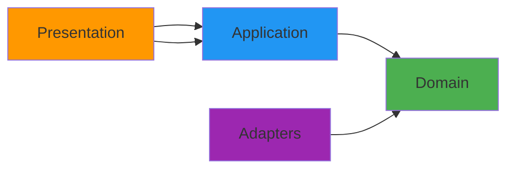
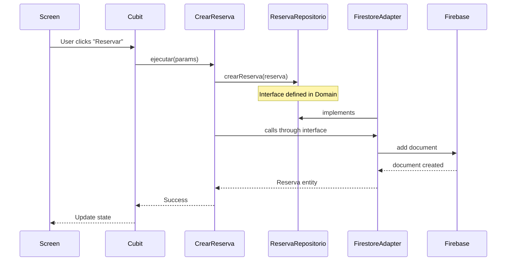

## What is Clean Architecture?

Clean Architecture is a software design philosophy that separates concerns into distinct layers with clear boundaries. The core principle is the **Dependency Rule**: dependencies point inward toward the domain, never outward.

## Layer Dependencies



<Note>
  The **Domain** layer is at the center and has no external dependencies. All other layers depend on it.
</Note>

## Four Layers Explained

### 1. Domain Layer (Core Business Logic)

**Location:** `lib/dominio/`

**Responsibilities:**
- Define business entities
- Define repository contracts (interfaces)
- Contain pure business logic
- No framework dependencies

**Example - Reserva Entity:**

```dart lib/dominio/entidades/reserva.dart
enum EstadoReserva {
  pendiente,
  confirmada,
  cancelada,
}

class Reserva {
  final String id;
  final String mesaId;
  final DateTime fechaHora;
  final int numeroPersonas;
  final int duracionMinutos;
  EstadoReserva estado;
  final String? contactoCliente;
  final String? nombreCliente;
  
  // Business logic method
  DateTime get horaFin => fechaHora.add(Duration(minutes: duracionMinutos));
  
  void confirmar() {
    if (estado == EstadoReserva.cancelada) {
      throw Exception('No se puede confirmar una reserva cancelada.');
    }
    if (estado == EstadoReserva.confirmada) {
      throw Exception('La reserva ya está confirmada.');
    }
    estado = EstadoReserva.confirmada;
  }
}
```

**Key Point:** The `Reserva` entity knows nothing about Firestore, Flutter, or any external framework. It's pure business logic.

### 2. Application Layer (Use Cases)

**Location:** `lib/aplicacion/`

**Responsibilities:**
- Orchestrate business operations
- Implement use cases (user stories)
- Coordinate between repositories
- Validate business rules

**Example - CrearReserva Use Case:**

```dart lib/aplicacion/crear_reserva.dart
class CrearReserva {
  final ReservaRepositorio reservaRepositorio;
  final MesaRepositorio? mesaRepositorio;
  final HorarioAperturaRepositorio? horarioAperturaRepositorio;
  final NegocioRepositorio? negocioRepositorio;
  final ServicioEmail? servicioEmail;

  Future<Reserva> ejecutar(
    String mesaId,
    DateTime fecha,
    DateTime hora,
    int numeroPersonas, {
    required String negocioId,
  }) async {
    // 1. Validate future date
    if (fechaHora.isBefore(DateTime.now())) {
      throw Exception('La fecha y hora deben ser futuras.');
    }
    
    // 2. Validate table capacity
    final mesa = await mesaRepositorio!.obtenerMesaPorId(mesaId);
    if (!mesa.puedeAcomodar(numeroPersonas)) {
      throw Exception('Mesa capacity mismatch');
    }
    
    // 3. Check business hours
    final estaAbierto = await horarioAperturaRepositorio!.estaAbiertoEn(
      negocioId,
      fechaHora,
    );
    
    // 4. Check table availability
    final mesaDisponible = await reservaRepositorio.mesaDisponible(
      mesaId: mesaId,
      fecha: fecha,
      hora: fechaHora,
      duracionMinutos: duracionMinutos,
    );
    
    // 5. Create reservation
    final reserva = await reservaRepositorio.crearReserva(reservaTemporal);
    
    // 6. Send notifications
    await servicioEmail?.notificarReservaConfirmada(reserva);
    
    return reserva;
  }
}
```

**Key Point:** Use cases depend on repository **interfaces**, not concrete implementations. They orchestrate the business flow without knowing about Firestore.

### 3. Adapters Layer (Infrastructure)

**Location:** `lib/adaptadores/`

**Responsibilities:**
- Implement repository interfaces
- Handle external services (Firebase, Email)
- Convert between domain entities and external formats
- Manage infrastructure concerns

**Example - Firestore Adapter:**

```dart lib/adaptadores/adaptador_firestore_reserva.dart
class ReservaRepositorioFirestore implements ReservaRepositorio {
  final FirebaseFirestore _firestore = FirebaseFirestore.instance;
  
  @override
  Future<Reserva> crearReserva(Reserva reserva) async {
    final docRef = await _firestore.collection('reservas').add(
      _reservaToMap(reserva)
    );
    return reserva.copyWith(id: docRef.id);
  }
  
  @override
  Future<bool> mesaDisponible({
    required String mesaId,
    required DateTime fecha,
    required DateTime hora,
    required int duracionMinutos,
  }) async {
    final reservas = await obtenerReservasPorMesaYHorario(
      mesaId: mesaId,
      fecha: fecha,
      hora: hora,
    );
    
    // Check for time collisions
    final horaInicio = hora;
    final horaFin = hora.add(Duration(minutes: duracionMinutos));
    
    for (final reserva in reservas) {
      final hayColision = horaInicio.isBefore(reserva.horaFin) &&
          horaFin.isAfter(reserva.fechaHora);
      if (hayColision) return false;
    }
    
    return true;
  }
  
  // Convert domain entity to Firestore map
  Map<String, dynamic> _reservaToMap(Reserva reserva) {
    return {
      'mesaId': reserva.mesaId,
      'fechaHora': Timestamp.fromDate(reserva.fechaHora),
      'numeroPersonas': reserva.numeroPersonas,
      'estado': _estadoToString(reserva.estado),
      // ...
    };
  }
}
```

**Key Point:** The adapter implements the repository interface defined in the domain layer. It handles all Firestore-specific details.

### 4. Presentation Layer (UI)

**Location:** `lib/presentacion/`

**Responsibilities:**
- Display data to users
- Handle user interactions
- Manage UI state with BLoC/Cubit
- Navigate between screens

**Example - Cubit State Management:**

```dart lib/presentacion/disponibilidad/disponibilidad_cubit.dart
class DisponibilidadCubit extends Cubit<DisponibilidadState> {
  final MesaRepositorio _mesaRepositorio;
  final CrearReserva _crearReserva;
  
  Future<void> buscarMesaEnZona({
    required String zona,
    required DateTime fecha,
    required DateTime hora,
    required int numeroPersonas,
  }) async {
    emit(DisponibilidadCargando());
    
    final mesa = await _mesaRepositorio.buscarMesaDisponibleEnZona(
      zona: zona,
      fecha: fecha,
      hora: hora,
      numeroPersonas: numeroPersonas,
    );
    
    if (mesa == null) {
      emit(DisponibilidadConError('No hay mesas disponibles'));
    } else {
      emit(MesaEncontrada(mesa, zona));
    }
  }
  
  Future<void> crearReservaVerificadaPorSMS({
    required String emailCliente,
    required String mesaId,
    required DateTime fecha,
    // ...
  }) async {
    emit(ProcesandoReserva());
    
    try {
      final reserva = await _crearReserva.ejecutar(
        mesaId,
        fecha,
        hora,
        numeroPersonas,
        contactoCliente: emailCliente,
        estadoInicial: EstadoReserva.confirmada,
      );
      
      emit(ReservaCreada('✅ Reserva confirmada exitosamente'));
    } catch (e) {
      emit(DisponibilidadConError('Error: ${e.toString()}'));
    }
  }
}
```

**Key Point:** Cubits depend on use cases and repositories, but never directly on infrastructure like Firestore.

## Dependency Injection

The system uses **GetIt** for dependency injection, configured in `service_locator.dart`:

```dart lib/service_locator.dart
final getIt = GetIt.instance;

void setupServiceLocator() {
  // Repositories (Infrastructure)
  getIt.registerLazySingleton<ReservaRepositorio>(
    () => ReservaRepositorioFirestore(),
  );
  
  getIt.registerLazySingleton<MesaRepositorio>(
    () => MesaRepositorioFirestore(
      reservaRepositorio: getIt<ReservaRepositorio>(),
    ),
  );
  
  // Use Cases (Application)
  getIt.registerLazySingleton<CrearReserva>(
    () => CrearReserva(
      getIt<ReservaRepositorio>(),
      mesaRepositorio: getIt<MesaRepositorio>(),
      horarioAperturaRepositorio: getIt<HorarioAperturaRepositorio>(),
      negocioRepositorio: getIt<NegocioRepositorio>(),
      servicioEmail: getIt<ServicioEmail>(),
    ),
  );
}
```

## Benefits of This Architecture

<CardGroup cols={2}>
  <Card title="Testability" icon="flask">
    Business logic can be tested without UI or database. Mock repositories easily for unit tests.
  </Card>
  
  <Card title="Maintainability" icon="wrench">
    Changes to infrastructure don't affect business logic. Clear boundaries prevent tight coupling.
  </Card>
  
  <Card title="Flexibility" icon="shuffle">
    Swap Firestore for another database by implementing new adapters. No changes to domain or application layers.
  </Card>
  
  <Card title="Scalability" icon="chart-line">
    New features follow the same pattern. Adding use cases doesn't complicate existing code.
  </Card>
</CardGroup>

## Dependency Flow Example



<Warning>
  Never let inner layers depend on outer layers. For example, a domain entity should never import Flutter widgets or Firestore classes.
</Warning>

## Testing Strategy

### Unit Tests (Domain & Application)

Test entities and use cases without any infrastructure:

```dart
test('Reserva.confirmar() throws if already cancelled', () {
  final reserva = Reserva(
    id: '1',
    mesaId: 'mesa1',
    fechaHora: DateTime.now(),
    numeroPersonas: 2,
    estado: EstadoReserva.cancelada,
  );
  
  expect(
    () => reserva.confirmar(),
    throwsException,
  );
});
```

### Integration Tests (Adapters)

Test repository implementations with real or mock Firebase:

```dart
test('ReservaRepositorioFirestore creates reservation', () async {
  final repo = ReservaRepositorioFirestore();
  final reserva = Reserva(/* ... */);
  
  final created = await repo.crearReserva(reserva);
  
  expect(created.id, isNotEmpty);
});
```

### Widget Tests (Presentation)

Test UI with mock dependencies:

```dart
testWidgets('Shows error when no tables available', (tester) async {
  final mockCubit = MockDisponibilidadCubit();
  when(mockCubit.stream).thenAnswer(
    (_) => Stream.value(DisponibilidadConError('No mesas'))
  );
  
  await tester.pumpWidget(DisponibilidadScreen(cubit: mockCubit));
  
  expect(find.text('No mesas'), findsOneWidget);
});
```

## Summary

Clean Architecture in this project provides:

1. **Clear separation** between UI, business logic, and infrastructure
2. **Testable code** at every layer
3. **Flexible implementations** that can be swapped easily
4. **Maintainable codebase** with well-defined boundaries
5. **Scalable structure** for adding new features

<Info>
  Understanding these principles is crucial for contributing to the project. Always respect layer boundaries and the dependency rule.
</Info>