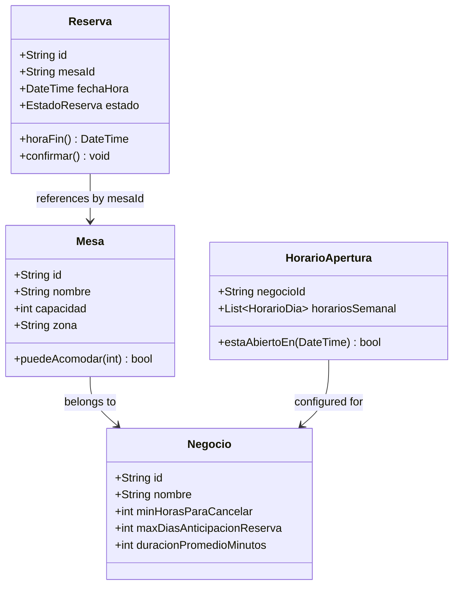
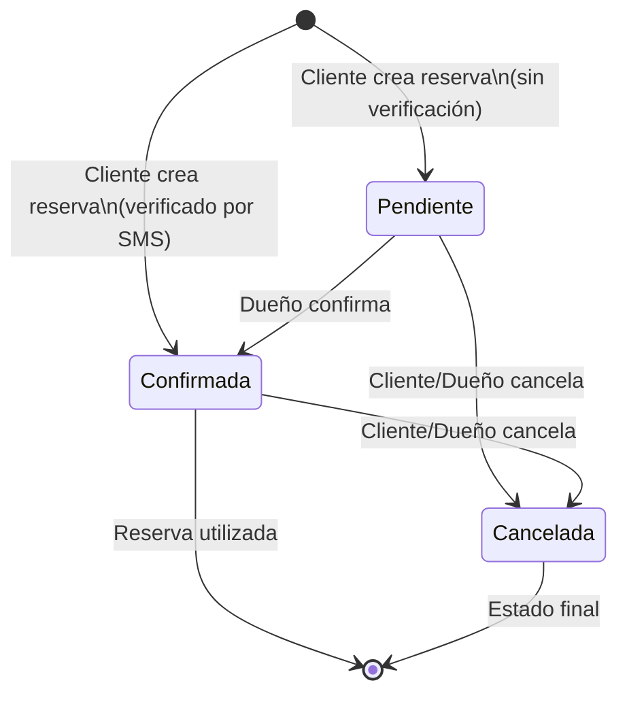

## Overview

The **Domain Layer** is the heart of the application, containing the core business logic and rules. It has no dependencies on external frameworks or libraries—it's pure Dart code.

**Location:** `lib/dominio/`

```
lib/dominio/
├── entidades/
│   ├── reserva.dart
│   ├── mesa.dart
│   ├── negocio.dart
│   ├── horario_apertura.dart
│   └── historia_restaurante.dart
└── repositorios/
    ├── reserva_repositorio.dart
    ├── mesa_repositorio.dart
    ├── negocio_repositorio.dart
    ├── horario_apertura_repositorio.dart
    └── historia_repositorio.dart
```

## Entities

### Reserva (Reservation)

Represents a table reservation with all its business rules.

```dart lib/dominio/entidades/reserva.dart
enum EstadoReserva {
  pendiente,   // Awaiting confirmation
  confirmada,  // Confirmed by SMS verification
  cancelada,   // Cancelled by customer or restaurant
}

class Reserva {
  final String id;
  final String mesaId;
  final DateTime fechaHora;
  final int numeroPersonas;
  final int duracionMinutos;
  EstadoReserva estado;
  final String? contactoCliente;  // Email for notifications
  final String? nombreCliente;
  final String? telefonoCliente;  // Verified phone
  final String? negocioId;

  Reserva({
    required this.id,
    required this.mesaId,
    required this.fechaHora,
    required this.numeroPersonas,
    this.duracionMinutos = 60,
    this.estado = EstadoReserva.pendiente,
    this.contactoCliente,
    this.nombreCliente,
    this.telefonoCliente,
    this.negocioId,
  });

  /// Calculates the end time of the reservation
  DateTime get horaFin => fechaHora.add(Duration(minutes: duracionMinutos));

  /// Confirms a pending reservation
  void confirmar() {
    if (estado == EstadoReserva.cancelada) {
      throw Exception('No se puede confirmar una reserva cancelada.');
    }
    if (estado == EstadoReserva.confirmada) {
      throw Exception('La reserva ya está confirmada.');
    }
    estado = EstadoReserva.confirmada;
  }

  Reserva copyWith({/* ... */}) {
    // Immutable copy with modified fields
  }
}
```

<Note>
  The `horaFin` getter encapsulates business logic: a reservation occupies a table for a specific duration.
</Note>

### Mesa (Table)

Represents a restaurant table with capacity validation logic.

```dart lib/dominio/entidades/mesa.dart
class Mesa {
  final String id;
  final String nombre;      // e.g., "Mesa 1", "Terraza A"
  final int capacidad;      // Number of seats
  final String negocioId;   // Restaurant ID
  final String zona;        // "Terraza", "Salón", "Jardín", etc.

  Mesa({
    required this.id,
    required this.nombre,
    required this.capacidad,
    required this.negocioId,
    this.zona = 'Salón',
  });

  /// Business rule: Can this table accommodate the given number of people?
  bool puedeAcomodar(int numeroPersonas) {
    // Table must have enough capacity
    if (capacidad < numeroPersonas) {
      return false; // Too small
    }
    
    // Table can't be more than 3 seats larger
    // (avoids wasting large tables on small groups)
    if (capacidad > numeroPersonas + 3) {
      return false; // Too large
    }
    
    return true; // Perfect fit
  }

  Mesa copyWith({/* ... */}) { /* ... */ }
}
```

**Business Rule:** A table is suitable if:
- `capacidad >= numeroPersonas` (not too small)
- `capacidad <= numeroPersonas + 3` (not too large)

This prevents assigning an 8-person table to a party of 2.

### Negocio (Restaurant/Business)

Represents the restaurant configuration and business rules.

```dart lib/dominio/entidades/negocio.dart
class Negocio {
  final String id;
  final String nombre;
  final String nombreResponsable;
  final String email;
  final String telefono;
  final String direccion;
  final String descripcion;
  final String especialidad;
  final String icono;  // Material icon name
  
  // Business Rules Configuration
  final int minHorasParaCancelar;        // Default: 24 hours
  final int maxDiasAnticipacionReserva;  // Default: 14 days
  final int duracionPromedioMinutos;     // Default: 60 minutes
  
  final List<String> zonas;              // Available zones
  final bool telefonoVerificado;

  Negocio({
    required this.id,
    required this.nombre,
    required this.nombreResponsable,
    required this.email,
    required this.telefono,
    required this.direccion,
    this.descripcion = '',
    this.especialidad = '',
    this.icono = 'restaurant',
    this.minHorasParaCancelar = 24,
    this.maxDiasAnticipacionReserva = 14,
    this.duracionPromedioMinutos = 60,
    this.telefonoVerificado = false,
    this.zonas = const ['Salón', 'Terraza'],
  });

  Negocio copyWith({/* ... */}) { /* ... */ }
}
```

<Info>
  Business configuration is stored in the `Negocio` entity, allowing each restaurant to have custom cancellation policies and reservation durations.
</Info>

### HorarioApertura (Business Hours)

Manages restaurant opening hours with support for multiple intervals per day.

```dart lib/dominio/entidades/horario_apertura.dart
class IntervaloHorario {
  final int horaInicio;    // 0-23
  final int minutoInicio;  // 0-59
  final int horaFin;
  final int minutoFin;

  /// Checks if a specific time falls within this interval
  bool contieneHora(int hora, int minuto) {
    final minutosTotales = hora * 60 + minuto;
    final minutosInicio = horaInicio * 60 + minutoInicio;
    int minutosFin = horaFin * 60 + minutoFin;
    
    // Handle midnight crossing
    if (minutosFin < minutosInicio) {
      minutosFin += 24 * 60;
      if (minutosTotales < minutosInicio) {
        final adjustedMinutosTotales = minutosTotales + 24 * 60;
        return adjustedMinutosTotales >= minutosInicio && 
               adjustedMinutosTotales < minutosFin;
      }
    }
    
    return minutosTotales >= minutosInicio && minutosTotales < minutosFin;
  }
}

class HorarioDia {
  final String nombreDia;  // "Lunes", "Martes", etc.
  final bool cerrado;
  final List<IntervaloHorario> intervalos;  // Multiple intervals (lunch/dinner)

  /// Checks if the restaurant is open at a specific time
  bool estaAbierto(int hora, int minuto) {
    if (cerrado || intervalos.isEmpty) return false;
    return intervalos.any((intervalo) => intervalo.contieneHora(hora, minuto));
  }
}

class HorarioApertura {
  final String negocioId;
  final List<HorarioDia> horariosSemanal;  // 7 days

  /// Checks if the restaurant is open at a specific date/time
  bool estaAbiertoEn(DateTime fecha) {
    final diaSemana = fecha.weekday;  // 1 = Monday, 7 = Sunday
    
    final horarioDia = horariosSemanal.firstWhere(
      (h) => _obtenerNumeroDia(h.nombreDia) == diaSemana,
      orElse: () => HorarioDia(nombreDia: '', cerrado: true),
    );
    
    return horarioDia.estaAbierto(fecha.hour, fecha.minute);
  }

  /// Returns a user-friendly error message when closed
  String obtenerMensajeError(DateTime fecha) {
    // Returns specific message based on day and intervals
  }
}
```

**Example:** A restaurant open for lunch (12:00-15:00) and dinner (19:00-23:00):

```dart
HorarioDia(
  nombreDia: 'Lunes',
  intervalos: [
    IntervaloHorario(horaInicio: 12, minutoInicio: 0, horaFin: 15, minutoFin: 0),
    IntervaloHorario(horaInicio: 19, minutoInicio: 0, horaFin: 23, minutoFin: 0),
  ],
)
```

## Repository Interfaces

Repositories define **contracts** for data access without specifying implementation details.

### ReservaRepositorio

```dart lib/dominio/repositorios/reserva_repositorio.dart
abstract class ReservaRepositorio {
  /// Creates a new reservation
  Future<Reserva> crearReserva(Reserva reserva);
  
  /// Retrieves all reservations
  Future<List<Reserva>> obtenerReserva();
  
  /// Cancels a reservation by ID
  Future<void> cancelarReserva(String reservaId);
  
  /// Updates an existing reservation
  Future<void> actualizarReserva(Reserva reserva);
  
  /// Gets a specific reservation by ID
  Future<Reserva?> obtenerReservaPorId(String reservaId);
  
  /// Gets active reservations for a table on a specific date/time
  Future<List<Reserva>> obtenerReservasPorMesaYHorario({
    required String mesaId,
    required DateTime fecha,
    required DateTime hora,
  });
  
  /// Checks if a table is available for a given time slot
  /// Detects time collisions with existing reservations
  Future<bool> mesaDisponible({
    required String mesaId,
    required DateTime fecha,
    required DateTime hora,
    required int duracionMinutos,
  });
  
  /// Gets customer's reservations by phone and restaurant
  Future<List<Reserva>> obtenerReservasPorTelefonoYNegocio({
    required String telefonoCliente,
    required String negocioId,
  });
}
```

### MesaRepositorio

```dart lib/dominio/repositorios/mesa_repositorio.dart
abstract class MesaRepositorio {
  /// Retrieves all tables
  Future<List<Mesa>> obtenerMesas();
  
  /// Gets a specific table by ID
  Future<Mesa?> obtenerMesaPorId(String mesaId);
  
  /// Gets all tables for a specific restaurant
  Future<List<Mesa>> obtenerMesasPorNegocio(String negocioId);
  
  /// Adds a new table
  Future<Mesa?> agregarMesa(Mesa mesa);
  
  /// Updates an existing table
  Future<bool> actualizarMesa(Mesa mesa);
  
  /// Deletes a table
  Future<bool> eliminarMesa(String mesaId);
  
  /// Gets available zones in a restaurant
  Future<List<String>> obtenerZonasDisponibles(String negocioId);
  
  /// Searches for an available table in a specific zone
  /// Returns the first suitable table or null if none available
  Future<Mesa?> buscarMesaDisponibleEnZona({
    required String zona,
    required DateTime fecha,
    required DateTime hora,
    required int numeroPersonas,
    required String negocioId,
  });
}
```

### NegocioRepositorio

```dart lib/dominio/repositorios/negocio_repositorio.dart
abstract class NegocioRepositorio {
  /// Registers a new restaurant
  Future<Negocio?> registrarNegocio(
    String nombre,
    String responsable,
    String email,
    String telefono,
    String direccion,
    String password,
  );
  
  /// Authenticates restaurant owner
  Future<Negocio?> autenticarNegocio(String email, String password);
  
  /// Gets all registered restaurants
  Future<List<Negocio>> obtenerTodosLosNegocios();
  
  /// Gets a specific restaurant by ID
  Future<Negocio?> obtenerNegocioPorId(String id);
  
  /// Gets a restaurant by email
  Future<Negocio?> obtenerNegocioPorEmail(String email);
  
  /// Updates restaurant information
  Future<bool> actualizarNegocio(Negocio negocio);
  
  /// Updates restaurant email
  Future<bool> actualizarEmail(String negocioId, String nuevoEmail);
}
```

### HorarioAperturaRepositorio

```dart lib/dominio/repositorios/horario_apertura_repositorio.dart
abstract class HorarioAperturaRepositorio {
  /// Gets business hours for a restaurant
  Future<HorarioApertura?> obtenerHorarioPorNegocio(String negocioId);
  
  /// Checks if restaurant is open at a specific date/time
  Future<bool> estaAbiertoEn(String negocioId, DateTime fecha);
  
  /// Gets error message when restaurant is closed
  Future<String> obtenerMensajeHorarioCerrado(
    String negocioId,
    DateTime fecha,
  );
  
  /// Gets available time slots for a given date
  Future<List<String>> obtenerIntervalosDisponibles(
    String negocioId,
    DateTime fecha,
    int intervaloMinutos,
  );
  
  /// Saves business hours configuration
  Future<bool> guardarHorario(HorarioApertura horario);
  
  /// Converts HorarioApertura to a string map for UI display
  Map<String, String> horarioAMapString(HorarioApertura horario);
  
  /// Converts string map to HorarioApertura entity
  HorarioApertura mapStringAHorario(
    String negocioId,
    Map<String, String> mapa,
  );
}
```

## Entity Relationships



## State Transitions

### Reserva State Machine



<Warning>
  A cancelled reservation (`Cancelada`) cannot transition to any other state. Attempting to confirm a cancelled reservation throws an exception.
</Warning>

## Business Rules Summary

<AccordionGroup>
  <Accordion title="Reservation Creation">
    - Date/time must be in the future
    - Cannot exceed `maxDiasAnticipacionReserva` (default 14 days)
    - Number of people must be > 0
    - Table must accommodate the group (capacity rules)
    - Restaurant must be open at the selected time
    - Table must be available (no time conflicts)
  </Accordion>
  
  <Accordion title="Reservation Cancellation">
    - Only `confirmada` or `pendiente` reservations can be cancelled
    - Customer must cancel at least `minHorasParaCancelar` hours in advance (default 24)
    - Reservation time must not have passed
    - Admin/owner can cancel without time restrictions
  </Accordion>
  
  <Accordion title="Table Assignment">
    - Table capacity must be greater than or equal to number of people
    - Table capacity must be less than or equal to number of people + 3
    - This optimizes table usage and prevents waste
  </Accordion>
  
  <Accordion title="Business Hours">
    - Supports multiple intervals per day (lunch/dinner)
    - Can handle midnight-crossing hours
    - Each day can be marked as closed
  </Accordion>
</AccordionGroup>

## Next Steps

<CardGroup cols={2}>
  <Card title="Application Layer" icon="gears" href="/architecture/application-layer">
    See how use cases orchestrate these entities
  </Card>
  
  <Card title="Adapters Layer" icon="plug" href="/architecture/adapters-layer">
    Learn how repositories are implemented with Firestore
  </Card>
</CardGroup>