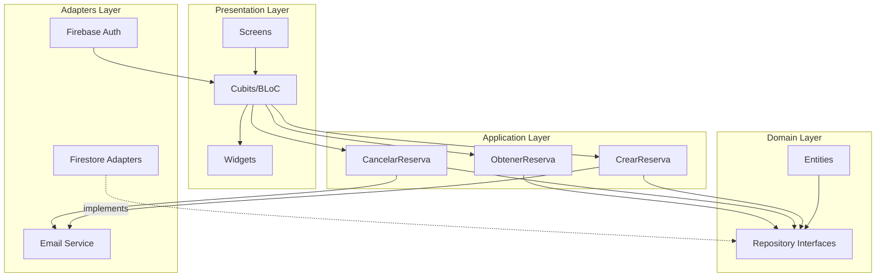
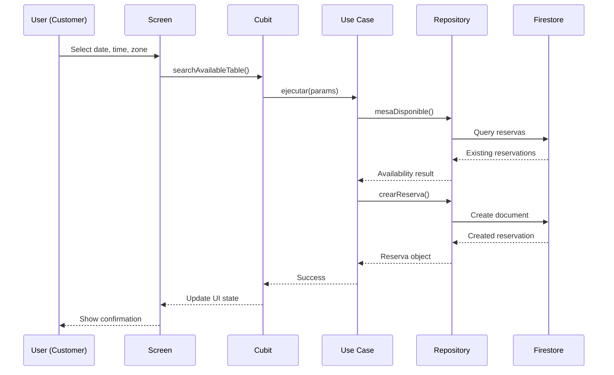

## System Architecture

The Restaurant Reservation System is built using **Clean Architecture** principles with Flutter/Dart, providing a scalable and maintainable solution for restaurant booking management.

## Architecture Diagram



## Layer Structure

```
┌──────────────────────────────────────────────┐
│            PRESENTATION (UI)                 │
│  Screens, Cubits (BLoC), Widgets             │
├──────────────────────────────────────────────┤
│            APPLICATION (Use Cases)           │
│  CrearReserva, CancelarReserva,              │
│  ObtenerReserva                              │
├──────────────────────────────────────────────┤
│            DOMAIN (Entities + Repositories)  │
│  Reserva, Mesa, Negocio, HorarioApertura,    │
│  Repository Interfaces                       │
├──────────────────────────────────────────────┤
│            ADAPTERS (Infrastructure)         │
│  Firestore, Firebase Auth, Email Service,    │
│  SMS Verification                            │
└──────────────────────────────────────────────┘
```

## Technology Stack

<CardGroup cols={2}>
  <Card title="Frontend" icon="mobile">
    - Flutter (Dart)
    - flutter_bloc (Cubits)
    - GoRouter for navigation
  </Card>
  
  <Card title="Backend" icon="database">
    - Firebase Cloud Firestore
    - Firebase Authentication
    - Firebase Extensions (Email)
  </Card>
  
  <Card title="State Management" icon="diagram-project">
    - BLoC/Cubit pattern
    - Reactive state updates
    - Separation of concerns
  </Card>
  
  <Card title="Dependency Injection" icon="plug">
    - GetIt service locator
    - Singleton pattern
    - Loose coupling
  </Card>
</CardGroup>

## Key Architecture Benefits

### 1. Separation of Concerns

Each layer has a specific responsibility and depends only on inner layers, never on outer layers.

### 2. Testability

Business logic is isolated in use cases and domain entities, making it easy to unit test without UI or infrastructure dependencies.

### 3. Flexibility

Infrastructure components (database, authentication) can be replaced without affecting business logic.

### 4. Maintainability

Clear boundaries between layers make the codebase easier to understand and modify.

## Core Principles

<AccordionGroup>
  <Accordion title="Dependency Rule">
    Dependencies flow inward. Outer layers depend on inner layers, but inner layers never depend on outer layers. The domain layer has no dependencies on frameworks or external tools.
  </Accordion>
  
  <Accordion title="Single Responsibility">
    Each class has one reason to change. Use cases handle one specific operation, repositories manage one entity type, and screens display one feature.
  </Accordion>
  
  <Accordion title="Interface Segregation">
    Repository interfaces define contracts that adapters must implement, allowing multiple implementations (Firestore, local storage, mock data).
  </Accordion>
  
  <Accordion title="Dependency Inversion">
    High-level modules (use cases) don't depend on low-level modules (Firestore). Both depend on abstractions (repository interfaces).
  </Accordion>
</AccordionGroup>

## System Actors

### Cliente (Customer)
- Creates and cancels reservations
- Verifies identity via SMS
- Views restaurant information and availability
- No account required

### Dueño (Restaurant Owner)
- Manages restaurant configuration
- Manages tables and zones
- Configures business hours
- Views and manages reservations
- Requires authentication

### Sistema (System)
- Validates business rules
- Sends automated emails
- Manages SMS verification
- Ensures data consistency

## Data Flow Example



## Next Steps

Explore each layer in detail:

<CardGroup cols={2}>
  <Card title="Clean Architecture" icon="layer-group" href="/architecture/clean-architecture">
    Learn about Clean Architecture principles applied in this project
  </Card>
  
  <Card title="Domain Layer" icon="cube" href="/architecture/domain-layer">
    Entities and repository interfaces
  </Card>
  
  <Card title="Application Layer" icon="gears" href="/architecture/application-layer">
    Use cases and business logic
  </Card>
  
  <Card title="Adapters Layer" icon="plug" href="/architecture/adapters-layer">
    Firestore implementations and services
  </Card>
  
  <Card title="Presentation Layer" icon="window-maximize" href="/architecture/presentation-layer">
    UI, state management, and user interactions
  </Card>
</CardGroup>