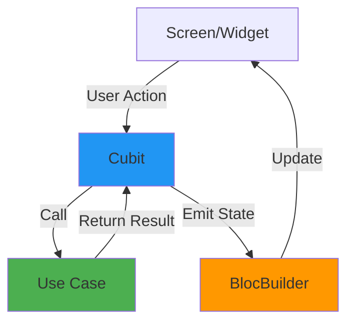
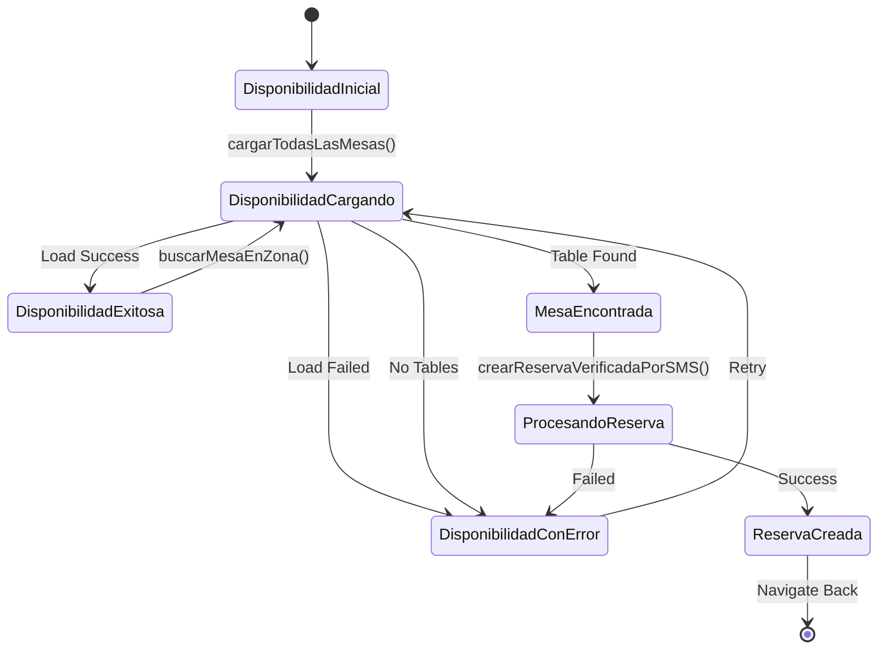
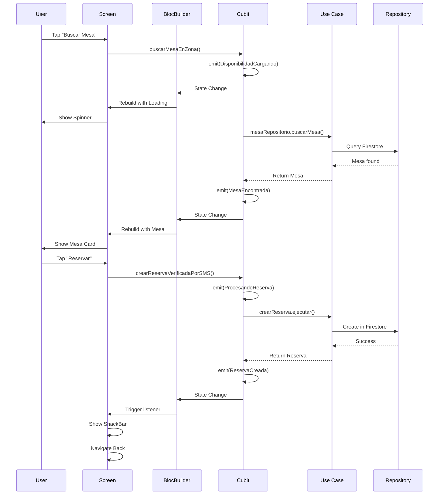

## Overview

The **Presentation Layer** handles everything the user sees and interacts with. It uses the **BLoC/Cubit** pattern for state management, keeping UI logic separate from business logic.

**Location:** `lib/presentacion/`

```
lib/presentacion/
├── disponibilidad/
│   ├── disponibilidad_screen.dart
│   ├── disponibilidad_cubit.dart
│   └── disponibilidad_estados_de_cubit.dart
├── mis_reservas/
│   ├── mis_reservas_screen.dart
│   ├── mis_reservas_cubit.dart
│   └── mis_reservas_estados_de_cubit.dart
├── pantalla_dueno/
│   ├── pantalla_dueno_screen.dart
│   ├── pantalla_dueno_cubit.dart
│   └── pantalla_dueno_estados_de_cubit.dart
├── pantalla_inicio/
│   ├── pantalla_inicio_screen.dart
│   ├── pantalla_inicio_cubit.dart
│   └── pantalla_inicio_estados_de_cubit.dart
└── widgets_comunes/
    ├── botones.dart
    ├── mensajes.dart
    ├── tarjeta_info.dart
    └── ...
```

## BLoC/Cubit Pattern

### Architecture



### Components

<CardGroup cols={3}>
  <Card title="Screen" icon="window-maximize">
    StatelessWidget that displays UI based on state
  </Card>
  
  <Card title="Cubit" icon="gears">
    Manages state and coordinates business operations
  </Card>
  
  <Card title="States" icon="sitemap">
    Immutable state classes representing UI states
  </Card>
</CardGroup>

## State Management Example

### 1. Define States

```dart lib/presentacion/disponibilidad/disponibilidad_estados_de_cubit.dart
@immutable
abstract class DisponibilidadState {}

class DisponibilidadInicial extends DisponibilidadState {}

class DisponibilidadCargando extends DisponibilidadState {}

class DisponibilidadExitosa extends DisponibilidadState {
  final List<Mesa> mesasDisponibles;
  final Negocio? negocio;
  final Map<String, String>? horariosServicio;

  DisponibilidadExitosa(
    this.mesasDisponibles, {
    this.negocio,
    this.horariosServicio,
  });

  int get duracionPromedioMinutos => negocio?.duracionPromedioMinutos ?? 60;
  int get maxDiasAnticipacionReserva => negocio?.maxDiasAnticipacionReserva ?? 14;
}

class DisponibilidadConError extends DisponibilidadState {
  final String mensaje;
  DisponibilidadConError(this.mensaje);
}

class MesaEncontrada extends DisponibilidadState {
  final Mesa mesa;
  final String zona;
  final int duracionPromedioMinutos;

  MesaEncontrada(this.mesa, this.zona, this.duracionPromedioMinutos);
}

class ReservaCreada extends DisponibilidadState {
  final String mensaje;
  ReservaCreada(this.mensaje);
}

class ProcesandoReserva extends DisponibilidadState {}
```

<Note>
  States are **immutable** (`@immutable`) and represent specific UI conditions. Each state contains only the data needed to render that UI state.
</Note>

### 2. Implement Cubit

```dart lib/presentacion/disponibilidad/disponibilidad_cubit.dart
class DisponibilidadCubit extends Cubit<DisponibilidadState> {
  final MesaRepositorio _mesaRepositorio;
  final NegocioRepositorio _negocioRepositorio;
  final CrearReserva _crearReserva;
  final HorarioAperturaRepositorio _horarioAperturaRepo;

  Negocio? _negocioActual;
  Negocio? get negocioActual => _negocioActual;

  DisponibilidadCubit()
    : _mesaRepositorio = getIt<MesaRepositorio>(),
      _negocioRepositorio = getIt<NegocioRepositorio>(),
      _crearReserva = getIt<CrearReserva>(),
      _horarioAperturaRepo = getIt<HorarioAperturaRepositorio>(),
      super(DisponibilidadInicial());  // Initial state

  String? _negocioId;

  /// Load all tables and business configuration
  Future<void> cargarTodasLasMesas([String? negocioId]) async {
    try {
      emit(DisponibilidadCargando());
      
      if (negocioId != null) {
        _negocioId = negocioId;
      }

      // Load first business if not specified
      if (_negocioId == null) {
        final negocios = await _negocioRepositorio.obtenerTodosLosNegocios();
        if (negocios.isNotEmpty) {
          _negocioId = negocios.first.id;
          _negocioActual = negocios.first;
        }
      }

      if (_negocioId == null) {
        emit(DisponibilidadConError('No hay negocios registrados'));
        return;
      }

      // Load data in parallel
      final resultados = await Future.wait([
        _mesaRepositorio.obtenerMesasPorNegocio(_negocioId!),
        _negocioRepositorio.obtenerNegocioPorId(_negocioId!),
        _horarioAperturaRepo.obtenerHorarioPorNegocio(_negocioId!),
      ]);

      final mesas = resultados[0] as List<Mesa>;
      _negocioActual = resultados[1] as Negocio?;
      final horario = resultados[2] as dynamic;
      final horarios = horario != null
          ? _horarioAperturaRepo.horarioAMapString(horario)
          : <String, String>{};

      emit(
        DisponibilidadExitosa(
          mesas,
          negocio: _negocioActual,
          horariosServicio: horarios,
        ),
      );
    } catch (e) {
      emit(
        DisponibilidadConError('Error al cargar los datos: ${e.toString()}'),
      );
    }
  }

  /// Search for available table in specific zone
  Future<void> buscarMesaEnZona({
    required String zona,
    required DateTime fecha,
    required DateTime hora,
    required int numeroPersonas,
  }) async {
    try {
      emit(DisponibilidadCargando());

      final negocioId = _negocioActual?.id ?? _negocioId ?? 'default';
      final mesa = await _mesaRepositorio.buscarMesaDisponibleEnZona(
        zona: zona,
        fecha: fecha,
        hora: hora,
        numeroPersonas: numeroPersonas,
        negocioId: negocioId,
      );

      if (mesa == null) {
        emit(
          DisponibilidadConError(
            'No hay mesas disponibles en $zona para $numeroPersonas personas '
            'en ese horario.\n\nIntenta con otra zona o un horario diferente.',
          ),
        );
      } else {
        emit(
          MesaEncontrada(
            mesa,
            zona,
            _negocioActual?.duracionPromedioMinutos ?? 60,
          ),
        );
      }
    } catch (e) {
      emit(DisponibilidadConError('Error al buscar mesa: ${e.toString()}'));
    }
  }

  /// Create reservation verified by SMS
  Future<void> crearReservaVerificadaPorSMS({
    required String emailCliente,
    required String telefonoVerificado,
    required String? nombreCliente,
    required String mesaId,
    required DateTime fecha,
    required DateTime hora,
    required int numeroPersonas,
  }) async {
    try {
      emit(ProcesandoReserva());
      
      print('🔄 Creando reserva verificada por SMS...');
      print('   📧 Email: $emailCliente');
      print('   📱 Teléfono: $telefonoVerificado');
      print('   👤 Nombre: $nombreCliente');

      // Create reservation with CONFIRMED status (SMS already verified)
      final negocioId = _negocioActual?.id ?? _negocioId ?? 'default';
      final reserva = await _crearReserva.ejecutar(
        mesaId,
        fecha,
        hora,
        numeroPersonas,
        contactoCliente: emailCliente,
        nombreCliente: nombreCliente,
        telefonoCliente: telefonoVerificado,
        estadoInicial: EstadoReserva.confirmada,
        negocioId: negocioId,
      );
      
      print('✅ Reserva creada con ID: ${reserva.id}');

      emit(
        ReservaCreada(
          '✅ Reserva confirmada exitosamente. '
          'Recibirás los detalles en tu email.',
        ),
      );
    } catch (e) {
      print('❌ Error creando reserva: $e');
      emit(
        DisponibilidadConError('Error al crear la reserva: ${e.toString()}'),
      );
    }
  }
}
```

<Info>
  Cubits use dependency injection via `getIt` service locator. They never create their own dependencies, making them testable.
</Info>

### 3. Build UI with BlocBuilder

```dart lib/presentacion/disponibilidad/disponibilidad_screen.dart
class DisponibilidadScreen extends StatelessWidget {
  final String? negocioId;

  const DisponibilidadScreen({super.key, this.negocioId});

  @override
  Widget build(BuildContext context) {
    return BlocProvider(
      create: (context) => DisponibilidadCubit()..cargarTodasLasMesas(negocioId),
      child: _DisponibilidadView(negocioId: negocioId),
    );
  }
}

class _DisponibilidadView extends StatefulWidget {
  final String? negocioId;
  const _DisponibilidadView({this.negocioId});

  @override
  State<_DisponibilidadView> createState() => _DisponibilidadViewState();
}

class _DisponibilidadViewState extends State<_DisponibilidadView> {
  DateTime? _fechaSeleccionada;
  String? _intervaloSeleccionado;
  int _numeroPersonas = 2;
  String? _zonaSeleccionada;

  @override
  Widget build(BuildContext context) {
    return Scaffold(
      appBar: AppBar(
        title: const Text('Buscar Disponibilidad'),
      ),
      body: SingleChildScrollView(
        padding: const EdgeInsets.all(20.0),
        child: Column(
          children: [
            // Zone selector
            _buildSelectorZona(),
            const SizedBox(height: 16),
            
            // Date selector
            _buildSelectorFecha(),
            const SizedBox(height: 16),
            
            // Time selector
            _buildSelectorHora(),
            const SizedBox(height: 16),
            
            // Number of people
            _buildSelectorPersonas(),
            const SizedBox(height: 24),
            
            // Search button
            BlocBuilder<DisponibilidadCubit, DisponibilidadState>(
              builder: (context, state) {
                final canSearch = _zonaSeleccionada != null &&
                                  _fechaSeleccionada != null &&
                                  _intervaloSeleccionado != null;
                
                return ElevatedButton(
                  onPressed: canSearch ? () => _buscarMesa(context) : null,
                  child: const Text('Buscar Mesa Disponible'),
                );
              },
            ),
            const SizedBox(height: 24),
            
            // Result display
            BlocConsumer<DisponibilidadCubit, DisponibilidadState>(
              listener: (context, state) {
                if (state is ReservaCreada) {
                  ScaffoldMessenger.of(context).showSnackBar(
                    SnackBar(content: Text(state.mensaje)),
                  );
                  context.pop();
                }
              },
              builder: (context, state) {
                if (state is DisponibilidadCargando) {
                  return const CircularProgressIndicator();
                }
                
                if (state is DisponibilidadConError) {
                  return Card(
                    color: Colors.red.shade50,
                    child: Padding(
                      padding: const EdgeInsets.all(16),
                      child: Text(
                        state.mensaje,
                        style: TextStyle(color: Colors.red.shade900),
                      ),
                    ),
                  );
                }
                
                if (state is MesaEncontrada) {
                  return _buildMesaEncontradaCard(context, state);
                }
                
                if (state is ProcesandoReserva) {
                  return const Column(
                    children: [
                      CircularProgressIndicator(),
                      SizedBox(height: 16),
                      Text('Creando tu reserva...'),
                    ],
                  );
                }
                
                return const SizedBox.shrink();
              },
            ),
          ],
        ),
      ),
    );
  }

  void _buscarMesa(BuildContext context) {
    final cubit = context.read<DisponibilidadCubit>();
    
    // Parse time from interval string (e.g., "12:00")
    final timeParts = _intervaloSeleccionado!.split(':');
    final hora = DateTime(
      _fechaSeleccionada!.year,
      _fechaSeleccionada!.month,
      _fechaSeleccionada!.day,
      int.parse(timeParts[0]),
      int.parse(timeParts[1]),
    );

    cubit.buscarMesaEnZona(
      zona: _zonaSeleccionada!,
      fecha: _fechaSeleccionada!,
      hora: hora,
      numeroPersonas: _numeroPersonas,
    );
  }

  Widget _buildMesaEncontradaCard(BuildContext context, MesaEncontrada state) {
    return Card(
      elevation: 4,
      child: Padding(
        padding: const EdgeInsets.all(16),
        child: Column(
          children: [
            const Text('✅ Mesa Disponible', style: TextStyle(fontSize: 20)),
            const SizedBox(height: 12),
            Text('Mesa: ${state.mesa.nombre}'),
            Text('Zona: ${state.zona}'),
            Text('Capacidad: ${state.mesa.capacidad} personas'),
            const SizedBox(height: 16),
            ElevatedButton(
              onPressed: () => _mostrarDialogoReserva(context, state.mesa),
              child: const Text('Reservar Esta Mesa'),
            ),
          ],
        ),
      ),
    );
  }

  Future<void> _mostrarDialogoReserva(BuildContext context, Mesa mesa) async {
    // Show dialog to collect customer info and verify SMS
    // Then call cubit.crearReservaVerificadaPorSMS()
  }
}
```

## State Flow Diagram



## Common Widgets

Reusable widgets are stored in `widgets_comunes/`:

### Botones (Buttons)

```dart lib/presentacion/widgets_comunes/botones.dart
class BotonPrimario extends StatelessWidget {
  final String texto;
  final VoidCallback? onPressed;
  final bool cargando;
  final IconData? icono;

  const BotonPrimario({
    required this.texto,
    this.onPressed,
    this.cargando = false,
    this.icono,
  });

  @override
  Widget build(BuildContext context) {
    return ElevatedButton.icon(
      onPressed: cargando ? null : onPressed,
      icon: cargando
          ? const SizedBox(
              width: 20,
              height: 20,
              child: CircularProgressIndicator(strokeWidth: 2),
            )
          : Icon(icono ?? Icons.check),
      label: Text(texto),
      style: ElevatedButton.styleFrom(
        padding: const EdgeInsets.symmetric(horizontal: 32, vertical: 16),
        textStyle: const TextStyle(fontSize: 16),
      ),
    );
  }
}
```

### Mensajes (Messages)

```dart lib/presentacion/widgets_comunes/mensajes.dart
void mostrarMensajeExito(BuildContext context, String mensaje) {
  ScaffoldMessenger.of(context).showSnackBar(
    SnackBar(
      content: Row(
        children: [
          const Icon(Icons.check_circle, color: Colors.white),
          const SizedBox(width: 12),
          Expanded(child: Text(mensaje)),
        ],
      ),
      backgroundColor: Colors.green,
      behavior: SnackBarBehavior.floating,
    ),
  );
}

void mostrarMensajeError(BuildContext context, String mensaje) {
  ScaffoldMessenger.of(context).showSnackBar(
    SnackBar(
      content: Row(
        children: [
          const Icon(Icons.error, color: Colors.white),
          const SizedBox(width: 12),
          Expanded(child: Text(mensaje)),
        ],
      ),
      backgroundColor: Colors.red,
      duration: const Duration(seconds: 5),
    ),
  );
}
```

## BlocConsumer vs BlocBuilder

### BlocBuilder

Use for **displaying** UI based on state:

```dart
BlocBuilder<MyCubit, MyState>(
  builder: (context, state) {
    if (state is Loading) {
      return CircularProgressIndicator();
    }
    if (state is Success) {
      return Text(state.data);
    }
    return SizedBox.shrink();
  },
)
```

### BlocConsumer

Use for **displaying + side effects** (navigation, dialogs, snackbars):

```dart
BlocConsumer<MyCubit, MyState>(
  listener: (context, state) {
    // Side effects
    if (state is Success) {
      ScaffoldMessenger.of(context).showSnackBar(
        SnackBar(content: Text('Success!')),
      );
      context.pop();  // Navigate back
    }
    if (state is Error) {
      showDialog(
        context: context,
        builder: (context) => AlertDialog(
          title: Text('Error'),
          content: Text(state.message),
        ),
      );
    }
  },
  builder: (context, state) {
    // UI rendering
    return /* ... */;
  },
)
```

<Warning>
  **Never** navigate or show dialogs in `builder`. Use `listener` for side effects. `builder` should only return widgets.
</Warning>

## Testing Presentation Layer

### Testing Cubits

```dart
test('DisponibilidadCubit emits loading then success', () async {
  // Arrange
  final mockMesaRepo = MockMesaRepositorio();
  final mockNegocioRepo = MockNegocioRepositorio();
  
  when(mockNegocioRepo.obtenerTodosLosNegocios())
      .thenAnswer((_) async => [Negocio(/* ... */)]);
  
  when(mockMesaRepo.obtenerMesasPorNegocio(any))
      .thenAnswer((_) async => [Mesa(/* ... */)]);
  
  final cubit = DisponibilidadCubit(
    mesaRepositorio: mockMesaRepo,
    negocioRepositorio: mockNegocioRepo,
  );
  
  // Act & Assert
  expect(
    cubit.stream,
    emitsInOrder([
      isA<DisponibilidadCargando>(),
      isA<DisponibilidadExitosa>(),
    ]),
  );
  
  cubit.cargarTodasLasMesas();
});
```

### Testing Widgets

```dart
testWidgets('Shows error message when state is error', (tester) async {
  // Arrange
  final mockCubit = MockDisponibilidadCubit();
  when(mockCubit.state).thenReturn(
    DisponibilidadConError('Error de prueba')
  );
  when(mockCubit.stream).thenAnswer(
    (_) => Stream.value(DisponibilidadConError('Error de prueba'))
  );
  
  // Act
  await tester.pumpWidget(
    MaterialApp(
      home: BlocProvider<DisponibilidadCubit>(
        create: (_) => mockCubit,
        child: DisponibilidadScreen(),
      ),
    ),
  );
  
  // Assert
  expect(find.text('Error de prueba'), findsOneWidget);
});
```

## Navigation with GoRouter

The app uses `GoRouter` for declarative routing:

```dart lib/router.dart
final router = GoRouter(
  initialLocation: '/',
  routes: [
    GoRoute(
      path: '/',
      builder: (context, state) => const PantallaInicioScreen(),
    ),
    GoRoute(
      path: '/disponibilidad',
      builder: (context, state) {
        final negocioId = state.uri.queryParameters['negocioId'];
        return DisponibilidadScreen(negocioId: negocioId);
      },
    ),
    GoRoute(
      path: '/mis-reservas',
      builder: (context, state) => const MisReservasScreen(),
    ),
    GoRoute(
      path: '/dueno',
      builder: (context, state) => const PantallaDuenoScreen(),
    ),
  ],
);
```

Navigation in code:

```dart
// Navigate to a route
context.go('/disponibilidad?negocioId=$id');

// Navigate and replace
context.replace('/mis-reservas');

// Go back
context.pop();

// Push (with back button)
context.push('/dueno');
```

## Key Patterns

### 1. Provide Cubit at Screen Level

```dart
class MyScreen extends StatelessWidget {
  @override
  Widget build(BuildContext context) {
    return BlocProvider(
      create: (context) => MyCubit()..loadData(),
      child: _MyScreenView(),
    );
  }
}
```

This ensures the Cubit is disposed when the screen is removed.

### 2. Access Cubit with context.read

```dart
// One-time read (for callbacks)
final cubit = context.read<MyCubit>();
cubit.someMethod();

// Watch for rebuilds (in builder)
final cubit = context.watch<MyCubit>();
```

### 3. Handle Async Errors

```dart
Future<void> performAction() async {
  try {
    emit(Loading());
    final result = await useCase.ejecutar();
    emit(Success(result));
  } catch (e) {
    emit(Error(e.toString()));
  }
}
```

### 4. Loading States

Always provide feedback for async operations:

```dart
if (state is Loading) {
  return const Center(
    child: CircularProgressIndicator(),
  );
}
```

## Summary

<CardGroup cols={2}>
  <Card title="BLoC Pattern" icon="diagram-project">
    Separate UI from business logic with Cubits
  </Card>
  
  <Card title="Immutable States" icon="lock">
    States are immutable and represent UI conditions
  </Card>
  
  <Card title="Reactive UI" icon="arrows-rotate">
    UI rebuilds automatically when state changes
  </Card>
  
  <Card title="Testable" icon="flask">
    Mock Cubits easily for widget testing
  </Card>
</CardGroup>

## Best Practices

<AccordionGroup>
  <Accordion title="Keep Cubits Simple">
    Cubits should coordinate, not implement business logic. Delegate to use cases.
  </Accordion>
  
  <Accordion title="One State Property Per Concern">
    Don't reuse states for different purposes. Create specific state classes.
  </Accordion>
  
  <Accordion title="Use BlocConsumer for Side Effects">
    Navigation, dialogs, and snackbars should be in `listener`, not `builder`.
  </Accordion>
  
  <Accordion title="Dispose Resources">
    Provide Cubits at screen level so they're automatically disposed.
  </Accordion>
  
  <Accordion title="Handle All States">
    Always handle loading, error, and empty states in your UI.
  </Accordion>
</AccordionGroup>

## Complete Flow Example



## Next Steps

<CardGroup cols={2}>
  <Card title="Architecture Overview" icon="sitemap" href="/architecture/overview">
    Review the complete system architecture
  </Card>
  
  <Card title="Clean Architecture" icon="layer-group" href="/architecture/clean-architecture">
    Understand how all layers work together
  </Card>
</CardGroup>