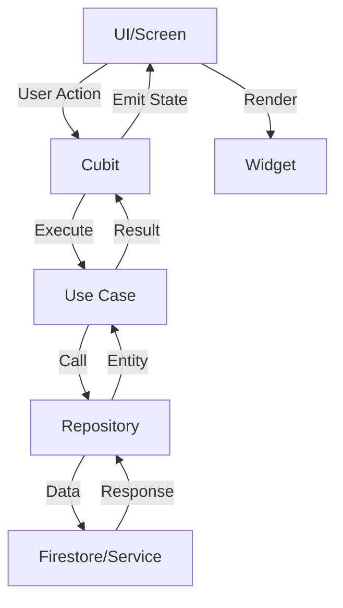

## Overview

The Restaurant Reservation System uses **BLoC (Business Logic Component)** pattern with **Cubit** for state management. This architecture separates business logic from UI, making the code testable, maintainable, and scalable.

## Architecture Overview



## Why BLoC/Cubit?

### Benefits

- **Separation of Concerns**: Business logic is separate from UI
- **Testability**: Easy to unit test without widgets
- **Reusability**: Same logic can be used across multiple screens
- **Predictable State**: Unidirectional data flow
- **Reactive**: UI automatically updates when state changes

### When to Use Cubit vs Bloc

| Pattern | Use Case | Example |
|---------|----------|----------|
| **Cubit** | Simple state transitions | Loading → Success/Error |
| **Bloc** | Complex event handling with multiple actions | Form validation with multiple fields |

This project uses **Cubit** for simplicity.

## Project Structure

```
lib/
├── presentacion/
│   ├── disponibilidad/
│   │   ├── disponibilidad_cubit.dart           # Business logic
│   │   ├── disponibilidad_estados_de_cubit.dart # State definitions
│   │   └── disponibilidad_screen.dart          # UI
│   ├── pantalla_dueno/
│   │   ├── pantalla_dueno_cubit.dart
│   │   ├── pantalla_dueno_estados_de_cubit.dart
│   │   └── pantalla_dueno_screen.dart
│   └── mis_reservas/
│       ├── mis_reservas_cubit.dart
│       ├── mis_reservas_estados_de_cubit.dart
│       └── mis_reservas_screen.dart
├── aplicacion/                                  # Use cases
│   ├── crear_reserva.dart
│   ├── cancelar_reserva.dart
│   └── obtener_reserva.dart
├── dominio/                                     # Domain entities & repos
│   ├── entidades/
│   └── repositorios/
└── adaptadores/                                 # Infrastructure
    ├── adaptador_firestore_*.dart
    └── servicio_*.dart
```

## Creating a Cubit

### Step 1: Define States

```dart lib/presentacion/disponibilidad/disponibilidad_estados_de_cubit.dart
import 'package:flutter/foundation.dart';
import '../../dominio/entidades/mesa.dart';
import '../../dominio/entidades/negocio.dart';

@immutable
abstract class DisponibilidadState {}

class DisponibilidadInicial extends DisponibilidadState {}

class DisponibilidadCargando extends DisponibilidadState {}

class DisponibilidadExitosa extends DisponibilidadState {
  final List<Mesa> mesasDisponibles;
  final Negocio? negocio;
  final Map<String, String>? horariosServicio;

  DisponibilidadExitosa(
    this.mesasDisponibles, {
    this.negocio,
    this.horariosServicio,
  });

  int get duracionPromedioMinutos => negocio?.duracionPromedioMinutos ?? 60;
  int get maxDiasAnticipacionReserva => negocio?.maxDiasAnticipacionReserva ?? 14;
}

class DisponibilidadConError extends DisponibilidadState {
  final String mensaje;
  DisponibilidadConError(this.mensaje);
}

class ReservaCreada extends DisponibilidadState {
  final String mensaje;
  ReservaCreada(this.mensaje);
}

class MesaEncontrada extends DisponibilidadState {
  final Mesa mesa;
  final String zona;
  final int duracionPromedioMinutos;

  MesaEncontrada(this.mesa, this.zona, this.duracionPromedioMinutos);
}

class ProcesandoReserva extends DisponibilidadState {}
```

<Tip>
  Use `@immutable` to ensure states are immutable and use `abstract class` for the base state type.
</Tip>

### Step 2: Implement the Cubit

```dart lib/presentacion/disponibilidad/disponibilidad_cubit.dart
import 'package:flutter_bloc/flutter_bloc.dart';
import '../../aplicacion/crear_reserva.dart';
import '../../dominio/repositorios/mesa_repositorio.dart';
import '../../dominio/repositorios/negocio_repositorio.dart';
import '../../service_locator.dart';
import 'disponibilidad_estados_de_cubit.dart';

class DisponibilidadCubit extends Cubit<DisponibilidadState> {
  final MesaRepositorio _mesaRepositorio;
  final NegocioRepositorio _negocioRepositorio;
  final CrearReserva _crearReserva;

  // Cache business data
  Negocio? _negocioActual;
  Negocio? get negocioActual => _negocioActual;

  DisponibilidadCubit()
    : _mesaRepositorio = getIt<MesaRepositorio>(),
      _negocioRepositorio = getIt<NegocioRepositorio>(),
      _crearReserva = getIt<CrearReserva>(),
      super(DisponibilidadInicial());

  Future<void> cargarTodasLasMesas([String? negocioId]) async {
    try {
      emit(DisponibilidadCargando());
      
      // Load business and tables in parallel
      final resultados = await Future.wait([
        _mesaRepositorio.obtenerMesasPorNegocio(negocioId!),
        _negocioRepositorio.obtenerNegocioPorId(negocioId),
      ]);

      final mesas = resultados[0] as List<Mesa>;
      _negocioActual = resultados[1] as Negocio?;

      emit(DisponibilidadExitosa(mesas, negocio: _negocioActual));
    } catch (e) {
      emit(DisponibilidadConError('Error al cargar: ${e.toString()}'));
    }
  }

  Future<void> buscarMesaEnZona({
    required String zona,
    required DateTime fecha,
    required DateTime hora,
    required int numeroPersonas,
  }) async {
    try {
      emit(DisponibilidadCargando());

      final mesa = await _mesaRepositorio.buscarMesaDisponibleEnZona(
        zona: zona,
        fecha: fecha,
        hora: hora,
        numeroPersonas: numeroPersonas,
        negocioId: _negocioActual?.id ?? 'default',
      );

      if (mesa == null) {
        emit(DisponibilidadConError(
          'No hay mesas disponibles en $zona para $numeroPersonas personas.'
        ));
      } else {
        emit(MesaEncontrada(
          mesa,
          zona,
          _negocioActual?.duracionPromedioMinutos ?? 60,
        ));
      }
    } catch (e) {
      emit(DisponibilidadConError('Error: ${e.toString()}'));
    }
  }

  Future<void> crearReservaVerificadaPorSMS({
    required String emailCliente,
    required String telefonoVerificado,
    required String? nombreCliente,
    required String mesaId,
    required DateTime fecha,
    required DateTime hora,
    required int numeroPersonas,
  }) async {
    try {
      emit(ProcesandoReserva());

      final reserva = await _crearReserva.ejecutar(
        mesaId,
        fecha,
        hora,
        numeroPersonas,
        contactoCliente: emailCliente,
        nombreCliente: nombreCliente,
        telefonoCliente: telefonoVerificado,
        estadoInicial: EstadoReserva.confirmada,
        negocioId: _negocioActual?.id ?? 'default',
      );

      emit(ReservaCreada(
        '✅ Reserva confirmada. Recibirás los detalles por email.',
      ));
    } catch (e) {
      emit(DisponibilidadConError('Error: ${e.toString()}'));
    }
  }
}
```

### Step 3: Use in UI

```dart lib/presentacion/disponibilidad/disponibilidad_screen.dart
import 'package:flutter/material.dart';
import 'package:flutter_bloc/flutter_bloc.dart';
import 'disponibilidad_cubit.dart';
import 'disponibilidad_estados_de_cubit.dart';

class DisponibilidadScreen extends StatelessWidget {
  const DisponibilidadScreen({Key? key}) : super(key: key);

  @override
  Widget build(BuildContext context) {
    return BlocProvider(
      create: (context) => DisponibilidadCubit()..cargarTodasLasMesas(),
      child: Scaffold(
        appBar: AppBar(title: const Text('Disponibilidad')),
        body: BlocConsumer<DisponibilidadCubit, DisponibilidadState>(
          listener: (context, state) {
            if (state is ReservaCreada) {
              ScaffoldMessenger.of(context).showSnackBar(
                SnackBar(content: Text(state.mensaje)),
              );
            } else if (state is DisponibilidadConError) {
              ScaffoldMessenger.of(context).showSnackBar(
                SnackBar(
                  content: Text(state.mensaje),
                  backgroundColor: Colors.red,
                ),
              );
            }
          },
          builder: (context, state) {
            if (state is DisponibilidadCargando) {
              return const Center(child: CircularProgressIndicator());
            }

            if (state is DisponibilidadExitosa) {
              return ListView.builder(
                itemCount: state.mesasDisponibles.length,
                itemBuilder: (context, index) {
                  final mesa = state.mesasDisponibles[index];
                  return ListTile(
                    title: Text(mesa.nombre),
                    subtitle: Text('Capacidad: ${mesa.capacidad}'),
                    onTap: () {
                      // Handle table selection
                    },
                  );
                },
              );
            }

            return const Center(child: Text('Selecciona una fecha'));
          },
        ),
      ),
    );
  }
}
```

## Dependency Injection with GetIt

The app uses **GetIt** for dependency injection:

```dart lib/service_locator.dart
import 'package:get_it/get_it.dart';
import 'adaptadores/adaptador_firestore_reserva.dart';
import 'adaptadores/servicio_email.dart';
import 'aplicacion/crear_reserva.dart';
import 'dominio/repositorios/reserva_repositorio.dart';

final getIt = GetIt.instance;

void setupServiceLocator() {
  // Prevent duplicate registration on hot reload
  if (getIt.isRegistered<ReservaRepositorio>()) {
    return;
  }

  // Services (singletons)
  getIt.registerLazySingleton<ServicioEmail>(
    () => ServicioEmail(),
  );

  // Repositories (singletons)
  getIt.registerLazySingleton<ReservaRepositorio>(
    () => ReservaRepositorioFirestore(),
  );

  getIt.registerLazySingleton<MesaRepositorio>(
    () => MesaRepositorioFirestore(
      reservaRepositorio: getIt<ReservaRepositorio>(),
    ),
  );

  // Use Cases (factories - new instance each time)
  getIt.registerFactory(
    () => CrearReserva(
      getIt<ReservaRepositorio>(),
      mesaRepositorio: getIt<MesaRepositorio>(),
      servicioEmail: getIt<ServicioEmail>(),
    ),
  );

  // Cubits (factories)
  getIt.registerFactory(
    () => PantallaDuenoCubit(
      getIt<NegocioRepositorio>(),
      getIt<MesaRepositorio>(),
      getIt<ReservaRepositorio>(),
    ),
  );
}
```

### Singleton vs Factory

| Type | When to Use | Example |
|------|-------------|----------|
| **Singleton** (`registerLazySingleton`) | Shared instance across app | `ServicioEmail`, `ReservaRepositorio` |
| **Factory** (`registerFactory`) | New instance each time | `CrearReserva`, Cubits |

## BLoC Patterns

### Pattern 1: Loading → Success/Error

```dart
Future<void> loadData() async {
  emit(LoadingState());
  try {
    final data = await repository.fetchData();
    emit(SuccessState(data));
  } catch (e) {
    emit(ErrorState(e.toString()));
  }
}
```

### Pattern 2: Processing → Success/Error

```dart
Future<void> processAction() async {
  emit(ProcessingState());
  try {
    await useCase.execute();
    emit(ActionCompletedState('Success!'));
  } catch (e) {
    emit(ErrorState(e.toString()));
  }
}
```

### Pattern 3: Optimistic Updates

```dart
Future<void> updateItem(Item item) async {
  // Immediately show updated UI
  emit(UpdatedState(item));
  
  try {
    await repository.update(item);
    // Success - keep the optimistic state
  } catch (e) {
    // Rollback on error
    emit(ErrorState('Failed to update'));
  }
}
```

## BlocBuilder vs BlocListener vs BlocConsumer

### BlocBuilder
Use when you only need to **rebuild UI** based on state:

```dart
BlocBuilder<DisponibilidadCubit, DisponibilidadState>(
  builder: (context, state) {
    if (state is DisponibilidadCargando) {
      return CircularProgressIndicator();
    }
    if (state is DisponibilidadExitosa) {
      return ListView(children: [...]);
    }
    return SizedBox();
  },
)
```

### BlocListener
Use when you need **side effects** (navigation, snackbars) but no UI rebuild:

```dart
BlocListener<DisponibilidadCubit, DisponibilidadState>(
  listener: (context, state) {
    if (state is ReservaCreada) {
      Navigator.pop(context);
      ScaffoldMessenger.of(context).showSnackBar(
        SnackBar(content: Text('Reserva creada!')),
      );
    }
  },
  child: MyWidget(),
)
```

### BlocConsumer
Use when you need **both** UI rebuild and side effects:

```dart
BlocConsumer<DisponibilidadCubit, DisponibilidadState>(
  listener: (context, state) {
    // Side effects
    if (state is DisponibilidadConError) {
      ScaffoldMessenger.of(context).showSnackBar(
        SnackBar(content: Text(state.mensaje)),
      );
    }
  },
  builder: (context, state) {
    // UI rebuild
    return MyWidget(state);
  },
)
```

## Testing Cubits

```dart test/disponibilidad_cubit_test.dart
import 'package:flutter_test/flutter_test.dart';
import 'package:bloc_test/bloc_test.dart';
import 'package:mocktail/mocktail.dart';

class MockMesaRepositorio extends Mock implements MesaRepositorio {}

void main() {
  late DisponibilidadCubit cubit;
  late MockMesaRepositorio mockMesaRepo;

  setUp(() {
    mockMesaRepo = MockMesaRepositorio();
    cubit = DisponibilidadCubit(
      mesaRepositorio: mockMesaRepo,
    );
  });

  tearDown(() {
    cubit.close();
  });

  group('DisponibilidadCubit', () {
    test('initial state is DisponibilidadInicial', () {
      expect(cubit.state, isA<DisponibilidadInicial>());
    });

    blocTest<DisponibilidadCubit, DisponibilidadState>(
      'emits [Loading, Success] when cargarTodasLasMesas succeeds',
      build: () {
        when(() => mockMesaRepo.obtenerMesasPorNegocio(any()))
          .thenAnswer((_) async => [Mesa(id: '1', nombre: 'Mesa 1')]);
        return cubit;
      },
      act: (cubit) => cubit.cargarTodasLasMesas('negocio1'),
      expect: () => [
        isA<DisponibilidadCargando>(),
        isA<DisponibilidadExitosa>(),
      ],
    );

    blocTest<DisponibilidadCubit, DisponibilidadState>(
      'emits [Loading, Error] when cargarTodasLasMesas fails',
      build: () {
        when(() => mockMesaRepo.obtenerMesasPorNegocio(any()))
          .thenThrow(Exception('Network error'));
        return cubit;
      },
      act: (cubit) => cubit.cargarTodasLasMesas('negocio1'),
      expect: () => [
        isA<DisponibilidadCargando>(),
        isA<DisponibilidadConError>(),
      ],
    );
  });
}
```

## Best Practices

<Warning>
  Never emit states inside `build()` method. This causes infinite loops!
</Warning>

### ✅ DO

- Keep states immutable
- Use meaningful state names
- Emit states in async methods
- Handle all states in UI
- Close cubits when done
- Use factories for cubits in GetIt

### ❌ DON'T

- Mutate state objects
- Emit states in `build()` or `initState()`
- Ignore error states
- Create cubits without disposing them
- Use singletons for cubits (use factories)

## Next Steps

- [Firebase Setup](/guides/firebase-setup) - Configure backend
- [Email Configuration](/guides/email-configuration) - Set up notifications
- [Testing](/guides/testing) - Write comprehensive tests